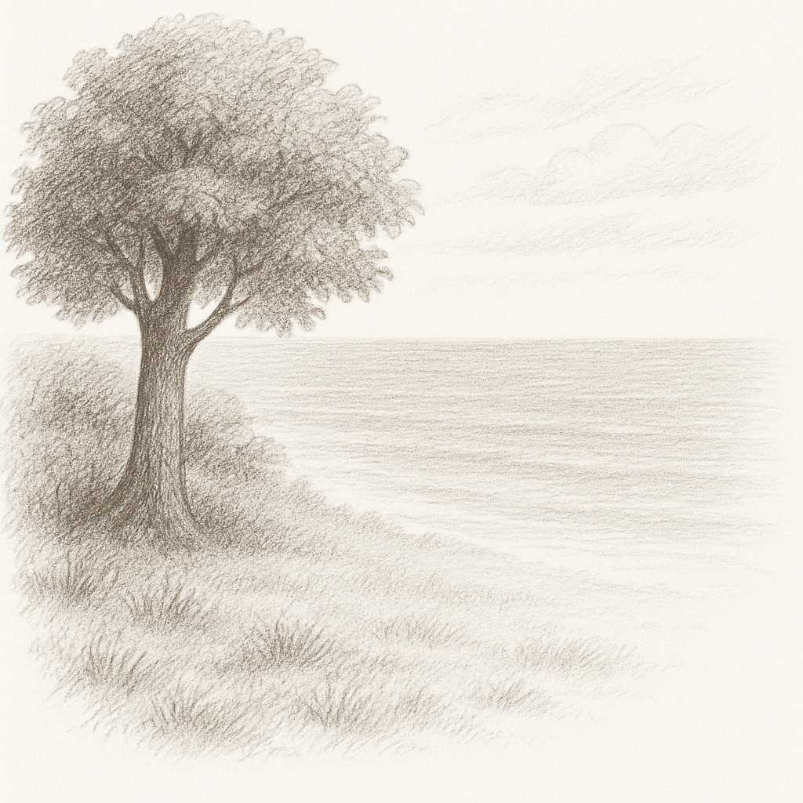

# 모든 것의 시작




> “완벽을 추구하기보다, 일단은 시작하라.”
— 리드 호프만 (LinkedIn 공동창업자)


앞선 챕터 ‘무작정 실행하기’에서 우리는 사전지식이 없는 상태로 코드를 작성하고, 실행까지 해 보았다. 어떤 구조인지도 모르고, 문법도 모른 채, 오직 한 가지 “그냥 해 보자는 마음”으로 Hello world!라는 문장을 화면에 띄운 것이다. 전혀 이해되지 않는 코드였지만, 버튼을 눌렀더니 결과가 나타나는 경험은 분명 신기하기도 하고, 의미 있는 경험이었을 것이다. 이제 그 안에 담긴 구성 요소를 하나씩 천천히 들여다볼 시간이다. 

그 첫걸음은 바로 이 코드이다.

```dart
void main() {
  print('Hello world!');
}
```

여기서 가장 먼저 눈에 들어오는 단어가 있다. 바로 main()이다. 이것을 우리는 main 함수라고 부른다. 함수가 무엇인지는 아직 배우지 않았지만, 지금은 “아, 이런 게 있구나” 정도로 가볍게 인식하고 넘어간다. 처음부터 모든 걸 이해하려고 애쓰는 것보다, 그냥 눈으로 보고, 손으로 따라하고, 반복하면서 익히는 방식이 때로는 더 효과적이기 때문이다. 다시 한번 웹 브라우저에 [DartPad](https://dartpad.dev/)로 이동해 위 코드를 직접 실행해본다.

Run 버튼을 누르는 순간, 화면 오른쪽 콘솔 창에 아래 문장이 잘 출력된다.

```dart
  Hello world!
```

불과 세 줄 남짓한 코드지만, 이 프로그램이 동작할 수 있었던 이유는 바로 main() 함수가 있었기 때문이다.

## 모든 프로그램의 시작
사실 모든 프로그램에는 시작 지점이 필요하다. 어디서부터 실행을 시작해야 하는지 정해두지 않으면, 컴퓨터는 우리가 작성한 수많은 코드 중 어떤 것부터 실행해야 할지 알 수가 없다. 바로 그 시작점이 main 이라고 하는 함수이다. 컴퓨터는 프로그램을 실행할 때 가장 먼저 이 main()이라는 이름을 가진 함수를 찾고, 그 안에 있는 명령어부터 차례로 순서대로 실행해 나가는 형태이다. 이 코드는 Dart에서 반드시 있어야 하며, 전체 코드가 어떻게 복잡하게 구성되어 있든 결국에는 이 main 함수가 있어야 실행이 가능한 것이다.

잘 이해가 안된다면, 바다를 예를 들어 보자. 바다는 한순간에 만들어진 것이 아니다. 수많은 강의 물줄기, 냇물이 모이고 흘러들어, 거대한 바다가 된다. 하지만 그 시작은 조용한 어느 숲속 아주 작은 샘물이었을지도 모른다. 프로그래밍도 마찬가지이다. 우리가 앞으로 작성하게 될 수많은 코드와 함수, 로직과 연산, 조건문과 반복문, 클래스와 객체들은 모두 흘러 흘러 결국 하나의 프로그램으로 완성될 것이다. 그러나 그 모든 흐름의 시작은 언제나 main 함수라는 작은 샘에서부터 시작된다. 이러한 의미에서 main() 함수는 모든 코드의 발원지이자, 프로그램이 눈을 뜨고 움직이기 시작하는 첫번째 신호인 것이다. 그래서 앞으로 Dart를 공부하면서 여러분이 작성하는 모든 코드는 결국 이 작은 함수 안에서 시작되거나, 그로부터 연결되어 실행될 것이다.

>**[팁&노트]**
실제로 한강(Han River)의 발원지는 강원도 태백시 창죽동, 금대봉(금대봉 북서쪽 계곡의 검룡소)이다. 검룡소는 한강의 공식 시발점으로, 태백산 계곡의 샘물이다. [^1]

---

[^1] https://ko.wikipedia.org/wiki/검룡소
