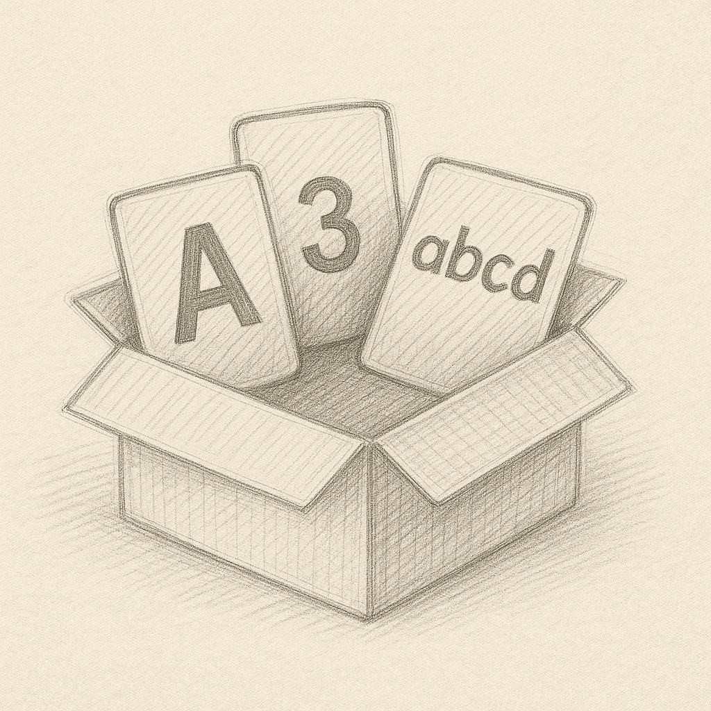

# 무언가를 담는 상자, 변수



> 프로그래밍이 어려운 이유는 눈에 보이지 않는 것을 상상하고 만들어내야 하기 때문이다.– 도널드 커누스(Donald E. Knuth)

## 무언가를 담기위한 상자

>**[팁&노트]**
**변수(變數) [명사]**
일정하지 않고 변할 수 있는 수. 또는 그런 양. 수학이나 물리학에서, 여러 가지 값을 취할 수 있는 양이나 기호. 프로그래밍 언어에서, 값을 저장하고 참조하기 위해 사용되는 메모리의 이름 또는 식별자. [^2]

프로그래밍에서 변수는 값을 저장하고 불러오는 도구이다. 처음 배우는 사람에게 변수는 다소 추상적으로 느껴질 수 있지만, 이렇게 비유하면 쉽다. 변수는 무언가를 담는 상자와 같다. 현실에서도 상자에 옷, 책, 장난감, 식료품 등 여러 물건을 담을 수 있듯이, 프로그래밍에서도 숫자·문자·불린 값(true/false)·객체·함수 같은 정보를 변수라는 이름의 ‘상자’에 담을 수 있다. Dart(다트) 언어에서 변수를 만들 때는 다음과 같은 문법을 사용한다.

>코드에 작성된 변수명은 이해를 돕기 위해 a, b, c 등으로 간단하게 작성했지만, 실제로는 의미 있는 이름을 붙이는 것이 좋다. 예를 들어, 사용자 이름을 저장하는 변수는 userName, 나이를 저장하는 변수는 userAge와 같이 작성한다.

```dart
var a = 0; //a 라는 이름의 상자에 숫자 0을 담는다.
var b = '텍스트'; //b 라는 이름의 상자에 문자 '텍스트'를 담는다.
```

이 코드에서 var는 variable의 약자로, 변할 수 있는 값을 담는 공간을 의미한다. (물론 이 공간은 눈에 보이지 않지만 최대한 상상력을 발휘하자) a = 0은 숫자 0이라는 값을 a라는 이름의 상자에 담았다는 뜻이다.

## 선언과 할당
변수를 사용할 때는 선언(declare) 과 할당(assign) 두 과정을 거친다. 먼저 변수 상자에 a라는 이름을 붙이는 것이 선언이다.

```dart
var a;
```

이렇게 선언만 해두면, 아직 안에 담긴 값은 없다. 따라서 이후에 어떤 값을 담으면 그것이 할당 이다.

```dart
a = 0;
```

Dart에서는 선언과 할당을 한 줄에 같이 쓸 수 있다. 이는 a 상자를 만들고 바로 숫자 0을 넣었다는 뜻이된다.

```dart
var a = 0;
```

이렇게 작성된 변수는 소스 코드상 어디든 활용할수 있다.

### AI와 함께 학습하세요
GPT와 같은 채팅형 AI 프로그램을 활용해 변수의 선언과 할당에 대해 더 자세히 공부해보자. AI를 활용하면 언제 어디서든 깊이 있는 학습을 할 수 있다. ChatGPT, Claude, Gemini 등 다양하게 사용해보고, 학습에 적극 활용하도록 하자.

> Q. Dart의 변수 선언과 할당의 차이가 뭔지 설명해줘.

## 상자안에는 한순간에 하나의 값만
이제 한 가지 흥미로운 질문이 생긴다. 아래와 같은 코드를 작성하면 어떤 일이 벌어질까?

```dart
var a = 0; // a라는 상자에 숫자 0을 담는다.
a = 1; // a라는 상자에 숫자 다시 1을 담는다.
a = 2; // a라는 상자에 숫자 2를 담는다.
```

이 코드의 결과로 a에는 어떤 값이 남을까? 단순히 생각해보면 혹시 3이 아닐까 싶지만… 정답은 2이다. 프로그래밍의 변수는 ‘여러 값을 누적’ 해서 담는 상자가 아니라, 항상 마지막으로 담은 값 하나만 기억하는 상자이다.

>만약 여러 값을 합산하고 싶다면 이렇게 작성하면 된다. +는 연산자(operator)로, 여러 값을 더하라는 명령을 나타낸다. 연산자에 대해서는 뒤에서 더 자세히 배울 예정이다.
>```dart
>a = 0 + 1 + 2; // a라는 상자에 0, 1, 2를 모두 더한 값을 담는다.
>```


## 상자안에 무엇이들어있는지 구분하기
현실 세계에서 상자에 어떤 물건이 들어 있는지 구분하기 위해 라벨을 붙이듯, 프로그래밍에서도 변수에 어떤 타입의 값이 들어갈 수 있는지를 미리 정해둘 수 있다. 이는 마치 상자에 어떤 종류의 물건만 넣을지 미리 정해두는 것과 비슷하다.

>Dart는 타입을 명확하게 구분하는 언어이다. 예를 들어, 숫자를 넣은 상자에는 다시 문자를 넣을 수 없다.

```dart
var a = 0; //a라는 변수를 선언하고 0을 할당했다.

//이번에는 다시 문자를 넣어볼까?
a = '안녕하세요'; // 오류 발생 -> 숫자 타입을 넣은 상자에 다시 문자를 넣을수 없다.
```

a라는 변수에 맨 처음 숫자를 넣은 순간, 이 상자는 “숫자 전용”이라는 라벨지가 붙게된다. 따라서 a라는 변수에 다시 다른 타입(숫자 이외의 값)을 할당 할 수 없고, 오직 숫자타입만 재할당 할수 있게 되는 것이다. 

### AI와 함께 학습하세요
>Q. Dart에서 var로 선언한 변수에 다른 타입의 값을 재할당 할수 없을까?


## 다양한 타입
Dart에는 숫자와 문자 이외에도 다양한 타입을 정의할수 있다. 이전에 var로 변수를 선언한것과 다르게 명확한 타입을 고정해서 변수를 정의할수 있다. 변수 선언시 명확하게 타입을 선언하면 어떤 타입인지 한눈에 알수 있기 때문에 코드의 가독성이 올라가게된다.

```dart
int a = 0;               // 숫자
String b = '안녕하세요';        // 문자열
bool c = true;           // 참/거짓
Object d = Object();     // 객체
Function e = () => '함수'; // 함수
```

> [팁&노트] 
“기본적으로 var를 사용하고, 복잡하거나 명확성을 높이고 싶은 경우에는 타입을 명시적으로 작성하라.” [^1]


변수는 우리가 프로그래밍을 할 때 가장 처음으로 마주하는 기본 개념이지만, 그 역할은 매우 중요하다. 우리는 값을 담기 위해, 그 값을 보관하고 꺼내기 위해, 또 그 값들을 서로 연결하거나 조작하기 위해 변수를 사용한다. 헷갈릴때는 무언가를 담는 상자(공간)를 떠올리자. 변수는 한번에 하나의 값만 담을수 있고, 타입이라는 라벨지을 통해 값을 구분한다. 앞으로 우리는 이 변수에 조건을 붙이고, 반복하게 하고, 여러 값들을 모아 조작할 수 있는 더 많은 방법을 배워나갈 것이다.

### AI와 함께 학습하세요
>Q. Dart에서 var로 선언한 변수와 명확한 타입으로 선언한 변수의 차이점을 알려줘.

>**[팁&노트]** <br> 
코드를 읽는 사람이 빠르고 정확하게 이해할 수 있는 정도를 '가독성' 이라고 표현한다. 즉, 코드를 작성한 사람뿐만 아니라 다른 사람도 쉽게 읽고 의미를 파악할 수 있도록 잘 정돈된 상태를 의미한다. 한마디로 가독성이 올라가면 코드를 읽고 단번에 분석하기가 쉽다는 의미이다!

## 추가로 알아두세요!
### late
var, int, String 이외에도 변수를 선언하는 또 다른 방법이 있다. 바로 late 키워드 이다. late 키워드는 String, int 처럼 명시적으로 변수를 선언하고, 맨앞에 키워드를 붙여주면 된다.

```dart
late int a;
```

이렇게 작성된 변수는 선언과 동시에 값을 할당하지 않아도 된다. 즉 late는 여러가지 상황에 따라서 a 라는 값을 "느리게" 할당할때 쓰는 키워드 이다.

```dart
late int a;
//...
//만약 코드 어딘가에서 이 변수를 쓰려고 한다면
print('과일의 종류 : $a'); // 오류가 발생한다. 왜냐하면 아직 a에 값이 할당되지 않았기 때문이다.
```

late로 선언된 변수는 우리가 사용하기 전에 언제든 한번은 반드시 초기화를 해주겠다는 일종의 약속의 의미가 담겨있다. 만약 약속을 지키지 않고 사용하려 했다면 오류를 만나게 된다.

### dynamic
우리가 앞서 배운 대로 보통은 아래와 같이 선언과 할당이 동시에 이루어진다.

```dart
var b = "안녕하세요"
```

위에서 배운대로 이렇게 선언된 변수는 “타입 추론” 을 통해서 내부적으로 타입이 고정된다.(다른 타입의 값을 다시 넣을수 없다.) 하지만 경우에 따라 좀 더 다양한 타입의 값을 할당해야 할 경우도 있을것이다. 그럴때 쓰는 것이 바로 dynamic 이다.

```dart
dynamic b = "안녕하세요"; // b라는 상자에 문자 '안녕하세요'를 담는다.
b = 1234; // b라는 상자에 숫자 1234를 담는다.
b = true; // b라는 상자에 true를 담는다.
```

dynamic 으로 작성된 변수는 예제를 보면 알수 있듯이 어떤 값이든 할당할수 있다. dynamic은 그야말로 만능처럼 보여지지만 절대 그렇지 않다. 만약 내부의 수많은 코드에 의해서 b 의 값이 지속적으로 변경된다면(상상력을 발휘...) 나중에는 해당 변수에 어떤값이 들어있는지 추측하기 굉장히 어려워진다. 이는 오류상황으로 이어질수 있기때문에, dynamic 을 사용할때는 세심한 주의가 필요하다.

## 추가로 알아두세요!
변수에 값을 할당한뒤, 콘솔창에 출력하는 방법을 익혀 보자. 예를 들어 '안녕하세요 000 입니다.' 라고 출력하고 싶다면, 아래와 같이 name 변수 선언 코드를 작성한뒤, '안녕하세요' 와 같은 문자열 안에 $ 기호를 사용해서 사용하면 된다. 이와 같은 방식을 문자열 보간(String Interpolation)이라고 한다. 문자열 보간을 사용하면 변수의 값을 문자열 안에 쉽게 삽입할 수 있다.

```dart
main(){
  var name = '홍길동';
  print('안녕하세요. $name 입니다.');
}
```

또한 문자열 안에서 객체에 포함된 변수나, 메서드의 값을 출력할때는 {} 기호를 사용하고, 아래와 같이 작성하면 된다. 객체나, 함수, 메서드에 대해서 아직 배우지 않았기 때문에, 우선은 "이런식으로 사용하는구나" 하고 넘어가도록 하자.
```dart
main(){
  var car = _Car();
  print('차의 이름은 ${car.name} 입니다.');
}
```


---


## Copilot 활용 실습
>VSCODE, Android Studio에서 Copilot을 활용해서 아래의 코드를 완성해보자.

String 타입 변수를 선언하고, 값을 넣고, 다시 바꾸고, 출력해보는 연습이다. Copilot의 자동완성을 적극 활용해보세요.


```dart
// 기본 변수 선언·할당 연습
void main() {
  // 1) 이름(name) 변수를 선언하고 자신의 이름을 할당
  // String name = ...;

  // 2) name을 다른 이름으로 재할당
  // name = ...;

  // 3) 출력
  // print를 통해 출력
}
```

---

[^1] **Variable (computer science)** : https://en.wikipedia.org/wiki/Variable_%28computer_science%29

[^2] - *Effective Dart: Usage*