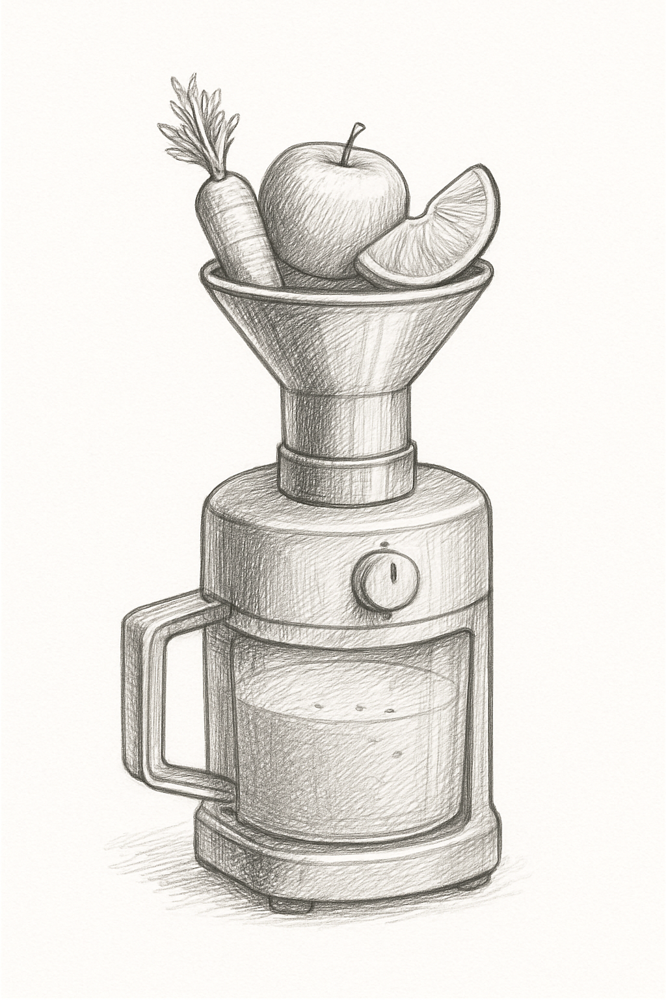

# 기능을 구현하다, 함수





>“좋은 함수는 하나의 일만 잘한다.” — 로버트 C. 마틴, 『클린 코드』


프로그래밍 언어에서 가장 기본적이면서도 강력한 개념 중 하나가 바로 함수(Function)이다. 함수는 특정 작업을 여러 번 반복하거나, 복잡한 로직을 분리해서 관리하고자 할 때 사용한다. 쉽게 말해 프로그램의 기능을 작은 단위로 나누어 재사용 가능하도록 만드는 방법이라고 볼 수 있다.

Dart를 포함한 대부분의 현대 프로그래밍 언어에서는 함수의 사용이 일반적이다. Dart의 함수 문법도 Java, JavaScript, Kotlin 등 다른 언어들과 매우 유사하기 때문에, 다른 언어를 조금이라도 경험해 본 사람이라면 쉽게 익힐수 있다.

예를 들어, 대부분의 언어에서 함수는 아래와 같은 구조를 가진다.

```dart
[리턴타입][함수이름](매개변수){
   [실행할코드];
   return [리턴값];
}
```

Dart에서도 이 구조는 거의 그대로 적용된다.

```dart
void sayHello() {
  print('Hello Dart!');
}
```

함수는 하나의 기능을 묶는 일종의 작은 실행 단위이다. 함수명을 통해 호출할 수 있고, 입력값(매개변수)을 받을 수 있으며, 필요에 따라 결과값(리턴값)을 반환하기도 한다.

>**[팁&노트]**
void 키워드는 이 함수가 아무 값도 반환(return)하지 않는다는 것을 나타낸다. 함수가 특정 결과값을 전달할 필요가 없는 경우, void를 사용하여 “출력값 없음” 을 명확히 표시하는것이 좋다.

예제를 더 살펴보자. 아래는 문자열을 입력받아, 다시 그대로 반환하는 함수이다.

```dart
String echoText(String text){// text는 매개변수(Parameter)라고 부른다.
  //...
	return text; // 리턴값은 함수가 실행을 마친 후, 호출한 위치로 되돌려주는 값이다.
}
```
```dart
main(){
  var result = echoText("안녕하세요."); // result 변수에 함수의 리턴값을 저장한다.
  print(result); // 출력: 안녕하세요.
}
```

>**[팁앤노트]** 
함수의 괄호 안에 있는 String text는 매개변수(Parameter)라고 부른다. 매개변수는 함수가 호출될 때 값을 전달 받아 저장하는 변수를 의미한다. 호출 시점에 넘겨주는 "안녕하세요" 는 인수 또는 인자(Argument) 라고 부른다.

함수는 이처럼 입력값(매개변수) 과 출력값(리턴값) 을 모두 가질 수 있다. return 키워드를 사용하면 함수는 실행을 마친 뒤, 결과값을 호출한 위치로 되돌려(return) 주는데, 예제의 경우 String 타입을 리턴한다고 선언했기 때문에, 반드시 문자열을 반환해야 한다. 그리고 그 반환값은 결국 result라는 변수에 저장되어 이후 코드에서 활용할 수 있게 된다. 

상황에 따라서는 입력값이 필요 없을 수도 있고, 결과를 반환할 필요가 없는 경우도 있다. 즉, 매개변수와 리턴값은 모두 필수 구현이 아니며, 함수의 목적에 따라 유연하게 구성하면 된다.

```dart
void emptyText(){ // 입력값이 없다.
	print('안녕하세요.'); // 기능구현 실행코드
} //return 이 필요 없다면 사실 void 는 생략도 가능하다.
```

```dart
//사용시
emptyText(); // 그럼 이렇게 () 형태의 빈칸으로 호출하면 된다.
```

만약 리턴값이 필요 없다면 함수의 반환 타입을 void로 명시하거나, 간단한 경우에는 생략이 가능하다. 전달할 입력값이 없다면, 함수 정의 시 괄호 안을 비워 () 형태로 작성하면 된다.

### AI와 함께 학습하세요
> Q. dart의 함수를 공부중인데, 만약 매개변수가 여러개인 함수를 작성하려면 어떻게 하면 될까?


## 심화학습

### 혼용되어 사용 하는 용어
실제 개발 실무에서는 “함수(Function)” 와 “메서드(Method)” 라는 용어가 자주 혼용되어 사용된다. 엄밀히 따지면 둘 사이에는 명확한 차이가 있지만, 일반적인 대화나 문서에서는 큰 구분 없이 서로 바꿔 쓰는 경우가 많다. 그 이유는 대부분의 함수가 클래스 안에서 정의되는 경우가 많기 때문에, 함수인지 메서드인지를 구분하기보다는 “기능을 수행하는 코드 블록” 정도의 의미로 받아들이는 경우가 많기 때문이다. 하지만 프로그래밍 개념을 정확하게 이해하기 위해서는 두 용어의 차이를 알고 있는 것이 좋다.

**함수와 메서드의 정의**
함수와 메서드를 구분하려면 먼저 클래스라는 개념을 이해해야 한다. 아직 배우지 않았지만 클래스는 객체지향 프로그래밍의 핵심 단위로, 앞서 배운 변수와 함수을 묶어 하나의 그룹으로 구조화시키는 방법이다. 이 클래스 내부에 작성되는 함수를 메서드 라고 부르고, 그 이외에 것들은 함수라고 부른다. (메서드 또한 큰 틀안에서 함수의 범위에 포함된다고 볼수 있다.)


<table>
  <thead>
    <tr>
      <th><strong>용어</strong></th>
      <th><strong>의미</strong></th>
    </tr>
  </thead>
  <tbody>
    <tr>
      <td><strong>함수 (Function)</strong></td>
      <td><strong>독립적으로 정의되고</strong>, 클래스와 무관하게 존재할 수 있는 코드 블록.</td>
    </tr>
    <tr>
      <td><strong>메서드 (Method)</strong></td>
      <td><strong>클래스에 소속된 함수</strong>. 클래스 안에 정의되어 있다.</td>
    </tr>
  </tbody>
</table>


```dart
// 실제 코드에서 차이를 알아보자
class Person { //class 정의
  String name;

  Person(this.name);

  void sayHello() {//Person 클래스 내부의 함수는 -> 메서드라고 부른다.
    print('안녕하세요, 메서드 입니다.');
  }
}
//외부에 어딘가...
// 클래스와 관계없이 독립적인 형태의 기능을 정의하는것을 함수라고 부른다.
void sayHelloEx() {
  print('안녕하세요, 함수 입니다.');
}
```


### AI와 함께 학습하세요
>Q. dart의 함수와 메서드의 차이를 예제를 통해 설명해줘.


---
## Copilot 활용 실습

위에서 배운 내용을 바탕으로 다양한 함수를 작성하고 실습해보자. 각각의 함수를 정의하고 호출하는 방법을 익혀보자.

```dart
//1) 기본 함수 작성 : 인사말 출력
void greetCustomer() {
  //print('안녕하세요!'); 
}

// copilot을 적극 활용하여 자유롭게 추가 함수를 완성해보자.
// void helloCustomer() {
//   ...
// }
  

// 작성한 함수를 호출해보자.
main(){
  //함수 호출하기
  greetCustomer();
  //orderComplete();
}
```


2) 이번에는 개인의 이름을 전달 받고, 맞춤화된 인사를 하려고 한다. 매개변수를 사용하는 함수를 만들어보자.

```dart
//이름을 전달 받아 인사말을 출력하는 함수
void greetWithName(String name){
  //print('안녕하세요, $name 님!');
  //print('오늘도 방문해주셔서 감사합니다.');
}

// 작성한 함수를 호출해보자.
main(){
  //매개변수와 함께 함수 호출
  greetWithName('홍길동');
  //...
}
```

3) 입력된 값을 통해 물건의 가격을 계산하는 함수를 만들려고 한다. 가격을 계산하고, 결과값을 돌려주는 함수를 만들어보자.

```dart
//물건 가격 계산하기
int calculatePrice(String size){
  if(size == 'small'){
    return 15000;
  } else if(size == 'medium'){
    //return ...
  } else if(size == 'large'){
    //return ...
  } else {
    return 0; // 잘못된 사이즈
  }
}

// 작성한 함수를 호출해보자.
main(){
  //함수 호출하고 결과값 받기
  int smallPrice = calculatePrice('small');
  //...
  
  print('스몰 사이즈 가격: $smallPrice 원');
  //...
  
}
```