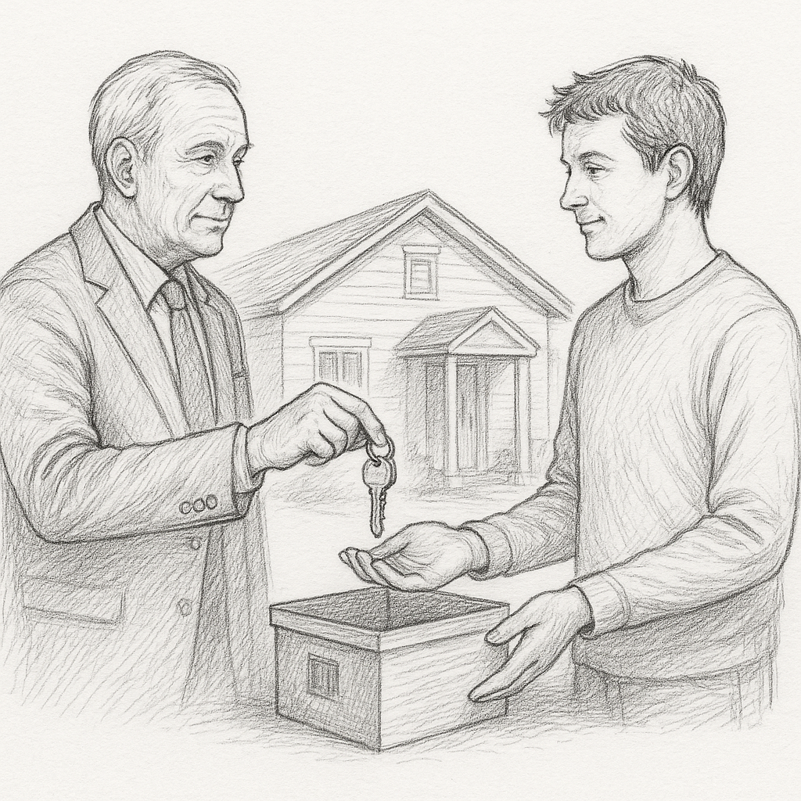

# 우리가 물려받는 것, 상속





>“삶은 조각들을 모아가는 과정이다. 결국 우리는 우리가 수집한 것으로 이루어진다.”— 짐 론 (Jim Rohn)


## **상속(Inheritance)**
현실세계의 "상속" 이라는 개념은 프로그래밍에서도 비슷한 개념으로 사용된다. 누군가의 무언가를 그대로 물려받는다는 건, 나의 출발이 조금 더 단단한 기반에서 시작된다는 의미가 된다.

dart 언어에서 상속을 표현하려면 extends 라는 키워드를 써야한다. extends는 직역하자면 ‘확장’ 이라고 해석할수 있다.

***“그럼 확장이라고 표현해야 맞지 않을까?”***

extends는 직역하면 “확장”으로 보이기 때문에 처음엔 그렇게 이해 하는 것이 더 쉬울 수수도 있다. 하지만 만약 이것을 단순히 “기능을 확장하는 도구” 로만 이해한다면, 이후에 배울 추상화, 계층 구조, 다형성 등의 개념을 이해하는 데 오히려 혼란을 줄 수 있다. 따라서 우리 책에서는 이하 상속이라고 표현한다.


## **extends 키워드**
아래 예제에는 A라는 클래스와, A를 상속한 B라는 클래스가 있다. Dart에서 클래스를 상속할 때는 extends 키워드를 사용하며, 이 키워드는 A에 있는 기능을 "그대로 물려받는다" 는 의미로 사용되어 진다.

```dart
class A { //부모클래스 정의
  var name = 'A';
  void sayHello(){
    print('클래스 A 입니다.');
  }
}
```

먼저 A클래스는 기본적으로 name이라는 속성과 sayHello()라는 기능(메서드)을 가지고 있다.

```dart
class B extends A {
  //B에는 아무것도 정의되지 않았다.
}
```

여기서 B extends A를 해석해보면 “B는 A를 확장했다.” 혹은 “B는 A의 상태와 기능을 물려받겠습니다.”라는 뜻으로 볼수 있다. 즉, A 클래스가 가진 모든 속성과 기능을 B도 사용할 수 있게 되는 것이다. 이는 굉장한 장점이라는 생각이 들것이다.

```dart
void main() {
  var b = B(); // B 클래스의 인스턴스 생성
  b.sayHello();  // 클래스 A의 sayHello() 호출
}
```

이 실행 코드는 B 클래스의 인스턴스를 만들고, sayHello()를 호출한다. B에는 분명히  sayHello 를 작성하지 않았지만 문제없이 호출할수 있으며, 이때 A 클래스의 sayHello가 호출되며 ‘클래스 A 입니다.’ 문구가 출력된다.

```dart
class A { //A는 부모클래스
  var name = 'A';
  void sayHello(){
    print('클래스 A 입니다.');
  }
}

class B extends A { //B는 자식클래스
//...
}

void main() {
  var b = B();
  b.sayHello();  //'클래스 A 입니다.'
}
```

이와 같은 상속 관계에서 A는 부모클래스, B는 자식클래스 라고 불리운다. 만약 이해가 어렵다면 현실세계를 잠시 생각해보자. 부모의 DNA를 물려받은 자식관계를 생각해보면 쉽게 접근할수 있다. 우리의 눈, 코, 입, 버릇, 식습관, 행동, 자산 등의 일부는 부모를 통해서 물려받은 것이지 않는가? (아니라고 하면 더이상 설명이 불가능하다.) 

## **상속의 장점**

조금 더 자세히 살펴보자. 만약 상속이 없다면 모든 클래스마다 중복된 기능을 일일이 다시 작성해야 할수도 있다. 예를 들어 아래와 같은 경우이다.

```dart
class Dog { // 개 클래스
  void speak() { // 동물이 내는 소리
    print('동물의 소리...');
  }
}

class Cat {// 고양이 클래스
  void speak() { // 동물이 내는 소리
    print('동물의 소리...');
  }
}
```

speak()라는 기능은 동물이라면 모두에게 필요한 공통 기능이라고 가정한다. 그래서 우리가 Animal 이라는 공통의 부모 클래스를 만들고, 각자의 클래스에서 이걸 상속하도록 만들어 보자.

```dart
class Animal { // 부모 클래스
  void speak() { // 동물이 내는 소리
    print('동물이 소리를 냅니다...');
  }
}
```

‘동물(Animal)’이라는 부모 클래스에는 모든 동물이 공통적으로 가지는 speak() 기능이 있다. 그렇기 때문에 ‘개(Dog)’라는 클래스를 만들면서 굳이 또 sound() 기능을 다시 만들 필요가 없다. 개와 고양이를 만들고 Animal을 상속하면 끝인 것이다.

```dart
class Dog extends Animal { }
class Cat extends Animal { }
```

이게 바로 상속이다. extends 키워드를 통해 기존 클래스의 기능을 그대로 물려받아 사용할수 있게 되었다.

## **고유 기능은 각자의 방식대로**
그런데 만약 각 동물들이 자신만의 방식으로 소리를 낸다면 어떻게 해야 할까? (개는 멍멍, 고양이는 야옹 등...) 그럴 땐, 물려받은 기능을 살짝 수정하면 된다. 이때 사용하는 것이 바로 override 이다.

```dart
class Dog extends Animal { // Animal 클래스를 상속받은 Dog 클래스
  @override // 재정의(override) 키워드
  void speak() { //부모에 정의된 메서드 형식을 그대로 가져온다.
    print('멍멍!'); //구현만 자신에 맞게 바꿔준다.
  }
}

class Cat extends Animal { // Animal 클래스를 상속받은 Cat 클래스
  @override // 재정의(override) 키워드
  void speak() { // 부모에 정의된 메서드 형식을 그대로 가져온다.
    print('야옹~'); // 구현만 자신에 맞게 바꿔준다.
  }
}
```

extends Animal이라는 키워드를 통해 Dog는 Animal의 기능을 상속받고, @override를 통해 speak() 기능을 자신의 방식대로 다시 정의했다. 이런 과정을 “재정의(override)” 라고 부른다.

```dart
void main() {
  var dog = Dog(); // Dog 클래스의 인스턴스 생성
  var cat = Cat(); // Cat 클래스의 인스턴스 생성

  dog.speak();  // 멍멍!
  cat.speak();  // 야옹~
}
```

어떤가? 이렇게 실행된 코드는 각각의 동물 소리를 내게 되었다.

### AI와 함께 학습하세요
>Q. Dart의 extends와, override에 대해서 초보자를 대상으로 쉽게 설명해줘.

---


## 심화학습
**재정의한 함수의 호출 경로 파악하기**
아래는 기본적인 Animal 클래스와, 이를 상속한 Dog, Cat 클래스의 예제이다. 

```dart
class Animal{ // 부모 클래스
 makeSound(){ // Animal 클래스의 숨쉬기 메서드
	 print('Animal의 소리내는 방법'); // Animal 클래스에서 숨쉬기 메서드 정의
 }
}
```

```dart
class Dog extends Animal { // Dog 클래스는 Animal 클래스를 상속
  @override
  void makeSound() {
    print('Dog의 소리! 멍멍~!'); // Dog 클래스에서 숨쉬기 메서드를 재정의
  }
}

class Cat extends Animal { // Cat 클래스는 Animal 클래스를 상속
  @override
  void makeSound() {
    print('Cat의 소리! 야옹~!'); // Cat 클래스에서 숨쉬기 메서드를 재정의
  }
}
```

Animal 클래스에는 breathe()라는 공통 메서드가 정의되어 있고, Dog와 Cat은 이 메서드를 @override 키워드를 사용해 자신만의 방식으로 재정의하고 있다.  

```dart
void main() {
  var dog = Dog(); // Dog 클래스의 인스턴스 생성
  var cat = Cat(); // Cat 클래스의 인스턴스 생성

  dog.makeSound(); // Dog 클래스의 makeSound() 메서드 호출
  cat.makeSound(); // Cat 클래스의 makeSound() 메서드 호출
}
```

코드를 실행해보면, 출력되는 결과는 다음과 같다.

```dart
Dog의 소리! 멍멍~!
Cat의 소리! 야옹~!
```

**“코드가 예상한대로 동작하고 있나요?”**
위 코드는 Dog와 Cat 클래스 각각의 makeSound() 메서드가 호출되었다. 이말은 즉, 부모 클래스인 Animal에 같은 이름의 메서드가 존재하더라도, 자식 클래스에서 같은 이름으로 메서드를 재정의했다면, 호출 시 자식 클래스의 메서드가 우선 실행된다는 뜻이 된다.

그럼 아래와 같이 dog에서 재정의 하지 않았다면, 어떻게 되는지 확인해보자.

```dart
class Dog extends Animal {
  // 아무것도 재정의하지 않음
}
```

이런 경우에는 상속받은 Animal 클래스의 메서드가 그대로 호출된다. 즉, 메서드를 재정의하지 않으면 부모의 기능을 그대로 사용하게 되는것이다.

```dart
void main() {
  var dog = Dog();
  dog.makeSound(); // 출력: Animal의 소리내는 방법
}
```

```dart
Animal의 소리내는 방법
```

## **super 키워드로 부모 기능 사용하기**

이런 경욱도 있을것이다. 만약 부모의 기능은 그대로 사용하고 싶고, 자식의 기능도 만들고 싶다면 아래와 같이 작성하면 된다. super 키워드를 통해 부모클래스에 정의된 변수, 메서드를 그대로 사용할수 있다.

```dart
class Dog extends Animal { // Animal 클래스를 상속받은 Dog 클래스
  @override // 재정의(override) 키워드
  void makeSound() {
    super.makeSound();// 자식에서 부모의 기능 먼저 호출
    print('그리고, 멍멍~! '); // 부모의 기능을 사용한 후, 자식의 기능 추가
  }
}
```


>**[팁&노트]**
super는 부모 클래스의 변수나 메서드에 접근할 때 사용된다. 반대로 this 키워드는 현재 클래스의 변수나 메서드를 명시적으로 참조할 때 사용한다. 둘 다 클래스 내부에서 참조 대상을 명확히 구분할 때 사용되며, 상속 관계를 이해하고 활용하는데 중요한 키워드이다.


### AI와 함께 학습하세요
>Q. Dart의 super, this 키워드를 활용한 예제를 제공해줘.

---

## Copilot 활용 실습

우리는 Animal 클래스를 만들고, 이 클래스를 상속받는 Dog, Cat 이라는 자식 클래스를 정의해보려 한다. 부모 클래스의 기능을 그대로 사용하는 기본 상속 예제를 따라가며, Copilot의 도움으로 빈칸을 채워보자.

```dart
// 부모 클래스 Animal 정의
class Animal {
  // 1) 동물이 내는 공통 소리를 정의
  void speak() {
    print('동물이 소리를 냅니다...');
  }
}

// 2) 자식 클래스 Dog 정의 (Animal 상속)
class Dog extends Animal {
  // 여기선 아무것도 새로 정의하지 않고, 부모 기능을 그대로 사용할 예정
}

// 3) 자식 클래스 Cat 정의 (Animal 상속)
class Cat extends Animal {
  // 고양이 특유의 소리를 내어보자.
  // override 키워드를 사용해서 speak를 작성해보자.
  //@override
  //...
}

// 4) main 함수에서 Dog와 Cat 객체를 생성하고, speak() 메서드를 호출해보자.
void main() {
  // 각 동물 객체를 만들어서 sound()를 호출해보자.
  var dog = Dog(); // Dog 클래스의 인스턴스 생성
  var cat = Cat(); // Cat 클래스의 인스턴스 생성

  dog.speak();  // 동물이 소리를 냅니다...
  cat.speak();  // 동물이 소리를 냅니다...
}
```