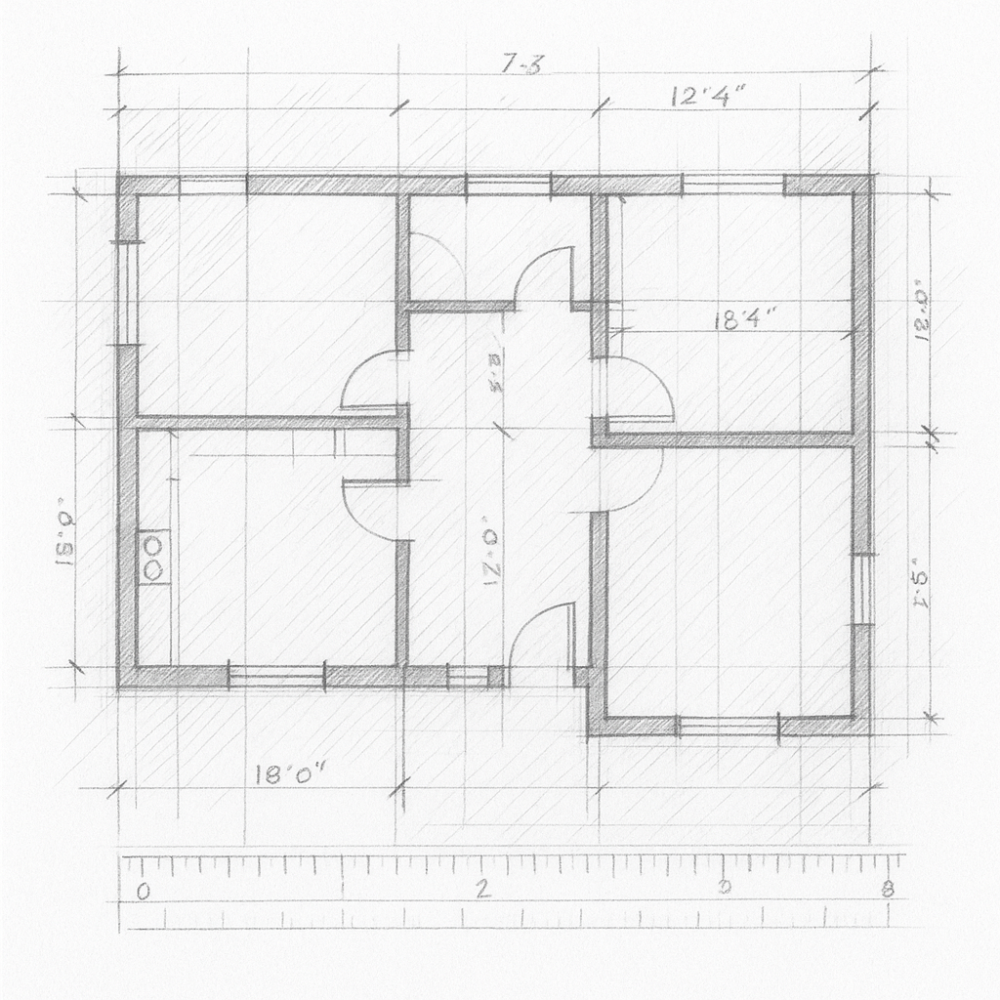

# 추상화(Abstraction)를 위한 도구들





>“가장 단순한 정리는, 가장 깊은 통찰에서 비롯된다.” — 레오나르도 다 빈치


## abstract class (추상 클래스)
Dart에서는 프로그래밍에 ‘추상화’라는 개념을 담아내기 위해 몇 가지 도구를 제공한다. 그 중 가장 먼저 살펴볼 것은 abstract class 이다. 작성하는 방법은 abstract 키워드를 포함하는 것, 이외에는 일반 클래스(class) 작성방법과 동일하다.

```dart
//추상 클래스
abstract class Car{ // 추상클래스
  String name = '자동차';
  
  void turnLight();// 바디없는함수를 작성 할수있다.
  void drive(){ // 바디있는함수도 작성할 수 있다.
    print('운전을 하다.');
  }
}
```

“뭐가 다르지?” 싶은데, 자세히 보면 이상한 부분이 하나 보인다. 바로 중괄호 { } 형태의 바디가 없는 메서드이다.

```dart
void turnLight(); //바디없는함수
```

이것은 오타가 아니다. 이런 형태로 작성된 메서드를 추상 메서드(abstract method)라고 부르며, 바디({ })가 없는 형태로 작성할수 있다.(구현부가 없다.)
또한 추상클래스는 개별적으로 인스턴스화 할수 없기 때문에 단독 활용은 불가능하다. 

```dart
main(){
	var car = Car(); // 오류: abstract class는 객체 생성을 할수 없다.
}
```

*“그럼 이 클래스를 대체 어디에 써야 할까?”*

abstract class는 클래스의 단독 사용 목적이 아닌 상속 구조를 통한, 공통의 기능구현(인터페이스화)에 촛점이 맞춰진 클래스이다. 추상클래스를 사용할때 주의할 점은 바디가 없는 추상 메서드를 작성했다면, 하위 클래스에서 반드시 구현해줘야 한다.

```dart
class MyCar extends Car{ //Car라는 추상클래스를 상속한다.
  @override
  void turnLight() {//Car 에 바디가 없는, 미구현 메서드를 필수로 구현해줘야 한다.
    print('라이트를 켜다');
  }
}
```

이로써 추상클래스에 정의된 추상적인 형태의 틀만 제공하는 메서드(바디가 없는)를 하위 클래스에서 구현하도록 강제 할수 있게 되는것이다. 즉 상위 클래스에서 설계한 뼈대를 토대로, 하위 클래스가 자신에 맞게 기능을 구현하면 되는것이다. 이처럼 추상클래스를 활용하면 클래스를 단순히 사용하는 것에서 벗어나 프로그램을 더 명확한 구조로 설계할수 있다.

## 상속과 구현
사실 Dart에서 '추상화' 를 위한 방법은 하나가 아니다. Dart에서는 추상클래스를 extends 하는 방식 외에도, implements 라는 키워드를 통해 기능을 구현하는 방법이있다. extends와 다르게 implements 키워드를 사용하면, Car 에 있는 모든 기능을 override 하도록 강제할수 있게된다.(바디가 있든 없든 전부!)

```dart
// implements로 구현
class MyCar implements Car { // implements 키워드를 사용
  // 바디가 있든, 없든 상관없이 Car의 모든 멤버를 구현해야 함
  @override
  String name = 'MyCar라는 자동차';

  @override
  void turnLight() {
    print('MyCar 자동차 라이트를 킨다.');
  }

  @override
  void drive() {
    print('MyCar 방식으로 운전한다.');
  }
}
```

코드를 살펴보면, Car추상클래스에 정의된 모든 상태와 기능, 즉 변수와 메서드를 전부 가져와 override한 것을 확인할 수 있다. 이는 단순히 필요한 부분만 골라서 구현 하는게 아니라, 필수적으로 모든 멤버를 직접 구현해야 하는 구조인 것이다.

---

## 심화학습
**상속과 구현의 이해**
쉽게 말해 상속(extends)은 마치 부모의 유산을 물려받는 개념이라고 이해할수 있다. 물려받은 그대로 사용할 수도 있고, 필요한 부분만 골라서 고쳐 쓸 수도 있다. 반면 구현(implements)은 설계도만 주어지고, 그 설계에 따라 모든 것을 직접 만들어야 하는 상황과 유사하다. 추상클래스(abstract class)는 말 그대로 뼈대만 존재하며, 이를 바탕으로 하위 클래스가 완전한 기능을 만들도록 강제하는 것이다.(하위 클래스가 곧 “구현체” 그 자체가 되는 셈이다.) 이건 마치 건축 현장을 보는 것과 비슷하다. 건축 사무소에 의뢰해서 설계도를 제공받고, 현장의 유능한 시공 업체가 직접 환경에 맞게 골조를 세우고 벽돌을 쌓아올려 집을 완성하듯이 말이다.

**class의 비밀**
사실은 class에는 잘 알려지지 않은 비밀이 하나 숨어 있다. 아래의 코드를 먼저 살펴보자.

```dart
class Car{ // 일반 클래스
  String name = '자동차';
  
  void drive(){
    print('운전을 하다.');
  }
}
```

```dart
class MyCar extends Car{ //Car를 상속받는 클래스
 //...
}
```

여기까지는 우리가 평소에 쓰던 클래스의 일반적인 사용 방법과 크게 다르지 않다. 일반 클래스를 선언하고, 그걸 상속받아 사용하는 구조, 그런데 아래 코드를 한번 보면 머릿속에 ?가 생긴다.

```dart
class MyCar implements Car{ // Car를 implements 하는 클래스
  @override
  String name = '내 차';

  @override
  void drive() {
    print('내 차로 운전한다.');
  }
	//...
}
```

사실 Car는 abstract class가 아님에도, MyCar 에서 implements로 구현하는 것이 가능하다.

**“어떻게 이런 일이 가능할까?”**
바로 여기서 Dart의 특별한 구조가 드러난다. Dart에서는 내부적으로 모든 클래스가 자동으로 인터페이스 역할도 할수 있도록 만들어져 있다.

>**[팁&노트]**
dart에서 모든 클래스는, 자신이 가진 모든 인스턴스 멤버들을 포함하는 인터페이스를 암묵적으로 정의한다. [^1]

그렇기 때문에 Dart에서는 abstract class 없이도 class 하나만 가지고 extends(상속)는 물론, implements(구현) 까지 자유롭게 사용할 수 있다. 이처럼 Dart는 유연한 설계를 허용하며, 상황에 따라 클래스가 다양한 역할을 할 수 있도록 설계되어 있다. 이런 점이 바로 Dart가 가진 설계 철학을 잘 보여주는 예일 것이다. 


### AI와 함께 학습하세요
>Q. 프로그래밍의 추상화 개념이 너무 어려운데, 초보자를 대상으로 비유를 들어서 자세히 설명해줘.

---

## **Interface class**

사실 추상화를 위한 더 강력한 방법이 존재한다. 바로 interface라는 키워드이다. 기존의 Dart(3.x이하)에서는 class와 abstract class만으로도 상속과 구현이 모두 가능했지만, 명확한 의미 부여나 개발자의 의도를 문법적으로 드러내는 데는 한계가 있었다. 이러한 한계를 보완하고, 현대 프로그래밍 언어들에서 널리 사용되던 구조를 반영하기 위해, Dart 3.x부터 interface class라는 새로운 키워드가 추가되었다.

>**[팁&노트]**
Dart3는 개발자의 의도를 더 명확하게 표현할 수 있도록 여러 클래스 수식어(modifier)를 도입했다. 그중 interface class는, “이 클래스는 상속하거나 섞지 말고, 오직 구현만 하세요” 라는 의도를 담고 있다. 이는 기존의 abstract class로는 모호하게 표현되던 부분을 명확하게 만들어준다.[^2]


인터페이스 클래스 정의하는 방법은 interface 키워드를 추가하는것 뿐이다. 아래 예제를 살펴보자.

```dart
interface class Animal { // interface 키워드를 사용하여 의도를 명확히 함
  void sound() {
    print('동물의소리');
  }
}

class Dog1 extends Animal {
  @override
  void sound() {
    print("멍멍1!");
  }
}

class Dog2 implements Animal {
  @override
  void sound() {
    print("멍멍2!");
  }
}

main(){
  var animal = Animal();
}
```

interface class를 자세히 들여다보면, 기능상으로는 일반 class와 거의 동일하게 동작하는것처럼 보인다. extends를 통해 상속할 수도 있고, implements를 통해 구현도 가능하며, 심지어 생성자를 통해 단독으로 객체를 생성하여 사용하는 것도 가능하다.

***“class 와 별 차이가 없다고?, 그럼 왜 필요한거지?”***

사실 위 예제에 extends가 가능하려면 전제조건이 있다. 바로 같은 파일 안에서 작성되어 있어야 한다는 조건이다. 만약 클래스별 파일을 따로 만든 상태에서(일반적인 경우), interface class를 extends하려 한다면, 컴파일 오류가 발생할것이다. 아래의 예제를 살펴보자.

```dart
// external_code.dart
interface class ExternalCode { // 외부 파일에서 interface class 정의
  void forTest(){
      //...
  }
}
```

```dart
// main.dart
class InternalCode implements ExternalCode{ // 외부 파일의 interface class를 구현 OK
  @override
  void forTest(){
    //...
  }
}

class InternalCode2 extends ExternalCode{ // 외부 파일의 interface class를 상속 X, 불가능
}
```

Dart에서 interface 키워드는 기능적인 제약은 물론, 그 클래스가 어떤 방식으로 사용되기를 ‘의도’ 했는지를 문법적으로 정의하기 위한 하나의 장치라고 볼수있다.


## Abstract interface class
의미상 좀 더 ‘추상화’ 에 가까운 방법이 있다. 바로 abstract interface class이다. 이 클래스는 내부에 추상 메서드(바디 없는)를 작성할 수 있고(abstract의 특성), 하위 타입에 implements 키워드를 사용할 경우, 모든 구현, 미구현 멤버를 override 해도록 강제 한다. 또한 abstract 답게 객체를 직접 생성해서 단독 사용할 수 없다.(이런 특성은 타 언어의 Interface의 개념과 유사하다고 볼수 있다.)

```dart
abstract interface class Bird {// 추상 인터페이스 클래스
  void fly(); // 바디 없음, 추상 메서드로 정의
}
```

```dart
class Sparrow implements Bird { // Bird 인터페이스를 구현
  @override
  void fly() { // 반드시 구현해야 함
    print("Sparrow is flying");
  }
}
```

```dart
void main() {
  Sparrow sparrow = Sparrow(); // Sparrow 객체 생성
  sparrow.fly(); // 출력: Sparrow is flying
}
```

## 심화학습
모호한점은 abstract interface class 는 바디가 있는 메서드도 작성할 수 있다는 것이다.(또한 파일내부에 정의되어 있다면 extends 키워드를 사용하여 상속 형태로 활용할 수도 있다.) 결국 기능적으로 따지고 보면, 기존의 abstract class, interface class, abstract interface class 는 모두 비슷한 기능을 제공하는것 처럼 보인다. 

***“대체 왜 이렇게 헷갈리게 만들어놓은 걸까? 뭘 어디에 써야 하는거야?”***

사실 Dart에서 제공하는 클래스를 정의하는 방법들 즉, class, abstract class, interface class, abstract interface class 이 네 가지 클래스 정의 방식은 자세히 들여다 보면 각기 다른 목적이 있지만, 실제로 사용해보면 기능상의 제약(강제력)이 적기 때문에 “이걸로 해도 되고, 저걸로 해도 되는” 상황이 발생한다.

예를 들어 일반 class 하나만 가지고도 extends를 통해 상속도 가능하고, implements를 통해 구현, 객체 생성도 자유롭게 가능하다. 이렇다 보니 사용자는 오히려 어떤 상황에서 어떤 클래스를 써야 하는지 혼란스러워질 수 밖에없다.

따라서 Dart 언어를 다룰때 중요한 것은 기능보다는 “의도” 에 포인트를 두고, 코드를 작성하도록 하는 것이다. 이 클래스가 상속을 위한 것인지, 설계도 역할을 위한 것인지, 혹은 단순 객체 정의를 위한 것인지 이러한 사용 목적과 의도를 코드 안에 명확하게 담아두는 것이 훨씬 중요하다.

<table>
  <thead>
    <tr>
      <th><strong>구분</strong></th>
      <th><strong>상속 가능 (`extends`)</strong></th>
      <th><strong>구현 가능 (`implements`)</strong></th>
      <th><strong>추상 메서드 작성</strong></th>
      <th><strong>인스턴스 생성</strong></th>
      <th><strong>사용 목적/의도</strong></th>
    </tr>
  </thead>
  <tbody>
    <tr>
      <td><strong>class</strong></td>
      <td>언제나 가능</td>
      <td>언제나 가능</td>
      <td>불가<br>(`abstract` 키워드 필요)</td>
      <td>가능</td>
      <td>일반 클래스, 범용</td>
    </tr>
    <tr>
      <td><strong>abstract class</strong></td>
      <td>언제나 가능</td>
      <td>언제나 가능</td>
      <td>가능</td>
      <td>불가</td>
      <td>부분 구현 포함 추상 설계</td>
    </tr>
    <tr>
      <td><strong>interface class</strong></td>
      <td>같은 라이브러리 내에서만
      <td>언제나 가능</td>
      <td>불가<br>(`abstract` 키워드 필요)</td>
      <td>가능</td>
      <td>“구현 전용”의 의미 내포<br></td>
    </tr>
    <tr>
      <td><strong>abstract interface class</strong></td>
      <td>같은 라이브러리 내에서만</td>
      <td>언제나 가능</td>
      <td>가능</td>
      <td>불가</td>
      <td>“순수 인터페이스” 의도 표기, 일종의 계약사항을 설계할때</td>
    </tr>
  </tbody>
</table>


### AI와 함께 학습하세요
>Q. Dart의 추상화 방법이 굉장히 복잡하고 난해한것 같아. 실무에서는 어떤 기준으로 class, abstract class, interface class, abstract interface class 를 나눠서 써야 할까? '처음에는 이것만 써봐' 와 같은 초보자용 솔루션도 제공해줘.

---

## Copilot 활용 실습

추상 클래스(abstract class)를 정의하고, 하위 클래스에서 메서드를 구현해보는 실습을 해보자. 아래의 코드를 참고하여, 추상 클래스와 하위 클래스의 관계를 이해하고, 결과를 확인해보자.

```dart
// abstract class Vehicle을 정의해보자.
abstract class Vehicle {
  //1) 내부에는 name 변수와 move() 메서드, 그리고 stop() 메서드를 정의
  // String name = ...;
  
  void move() {
    print('움직입니다.');
  }

  // 2) stop()은 바디가 없는 '추상 메서드'도 작성
  //void stop(); //← 바디 없이 선언
}
```

```dart
// Car 클래스를 만들고 Vehicle을 상속받아보자.
class Car extends /* 3) Vehicle 추상 클래스를 상속 */ {
  // 4) stop() 메서드를 반드시 override 한다.
  // @override
  // void stop() {
  //   ... 
  // }
}
```

```dart
// Car2 클래스를 만들고 Vehicle을 implements 해보자.
// extends 와 다른점을 확인해보자.
class Car2 implements /*// Vehicle 추상 클래스를 상속 */ {
  // 6) move()와 stop() 메서드를 반드시 override 한다.
  //...

}
```

```dart
// 7) main 함수 안에서 Car 객체를 생성하고 move(), stop()등을 자유롭게 호출해보자.
void main() {
  // var car = ...
  // car.move();
  // car.stop();
}
```

---
[^1] dart class : https://dart.dev/language/classes

[^2] dart class-modifiers : https://dart.dev/language/class-modifiers