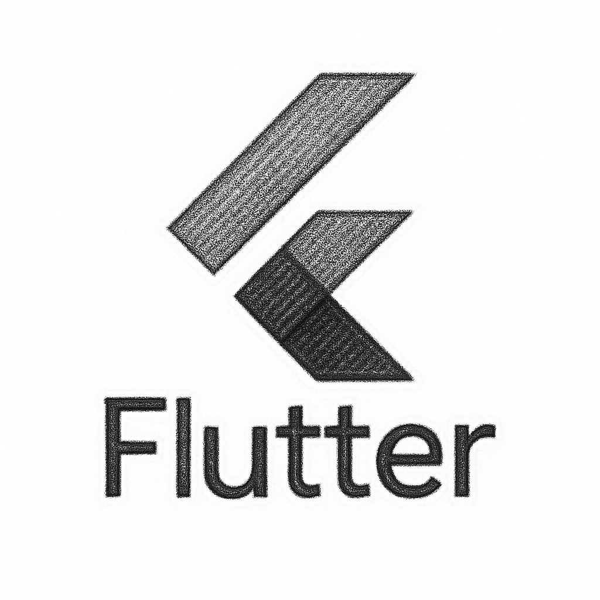

# 왜 플러터인가?

앱을 개발할 수 있는 도구는 시대의 변화와 함께 계속 진화해 왔다. 스마트폰이 일상이 된 지금, AI와 함께라면 코딩을 하고 어플리케이션을 개발하는 일은 더 이상 일부 전문가만의 일이 아닌, 누구나 도전할 수 있는 기술로 자리 잡았다. 양분된 플랫폼 시장에 맞게 iOS와 안드로이드는 각각의 네이티브 언어(Java, Kotlin/Swift,Objective-C)로 따로 개발해야 했지만, 오늘날에는 하나의 코드로 여러 플랫폼에 배포할 수 있는 크로스플랫폼 개발 방식이 널리 사용되고 있다.

그중에서도 이 책에서는 구글이 개발한 프레임워크인 Flutter를 중심으로 개발하고, 학습하도록 돕는 책이다. 플러터는 한 번의 개발로 iOS, Android는 물론, 웹, 윈도우, 맥OS 등 다양한 플랫폼에 배포할 수 있는 진정한 의미의 멀티플랫폼 개발 환경을 제공한다. 이 점만으로도 플러터는 개발자에게 매우 큰 장점이 된다. 특히, UI 구성 요소가 일관 되고 유려하며, 최신의 개발 흐름에 맞춘 구조를 제공하고 있기 때문에 적은 코드로 빠르게 완성도 높은 앱을 만들 수 있다.

최신의 언어 사양을 갖춘 플러터는 비교적 배우기 쉬운 편에 속하며, 문법도 간결하고 직관적이다. 다만, 플러터는 Dart라는 비교적 생소한 언어를 기반으로 하고 있기 때문에, 처음 접하는 분들은 “이걸 굳이 배워야 하나?” 하고 망설일 수도 있다. 하지만 Flutter개발을 위해서는 Dart를 반드시 익혀야 하며, 막상 사용해보면 간결한 문법 구조와 빠른 실행 속도 덕분에 초보자에게도 매우 적합한 언어임을 느끼게 된다. 안드로이드를 위해 Kotlin을, iOS를 위해 Swift를 익혀야 하는 것처럼, Flutter를 위한 Dart는 자연스러운 선택인 것이다.

물론 기술은 계속 변하고, 시장의 트렌드도 달라진다. 과거 PhoneGap(폰갭), Cordova(코르도바), Ionic(아이오닉) 등 다양한 크로스플랫폼 도구들이 있었지만 지금은 React Native와 Flutter가 주류로 자리 잡고있다. 그중에서도 플러터는 구글의 지원 아래 지속적으로 발전 중이며, 그 생태계 역시 활발하게 확장되고 있다.

결국 우리가 선택할 개발 도구는 지금 이 시점에서 가장 효율적이고, 배움에 있어 진입장벽이 낮으며, 실용적인 결과물을 만들어낼 수 있는 환경이어야 한다. 그런 의미에서, 지금 Flutter는 앱 개발을 시작하려는 사람에게 매우 좋은 선택이 될 수 있을것이다.