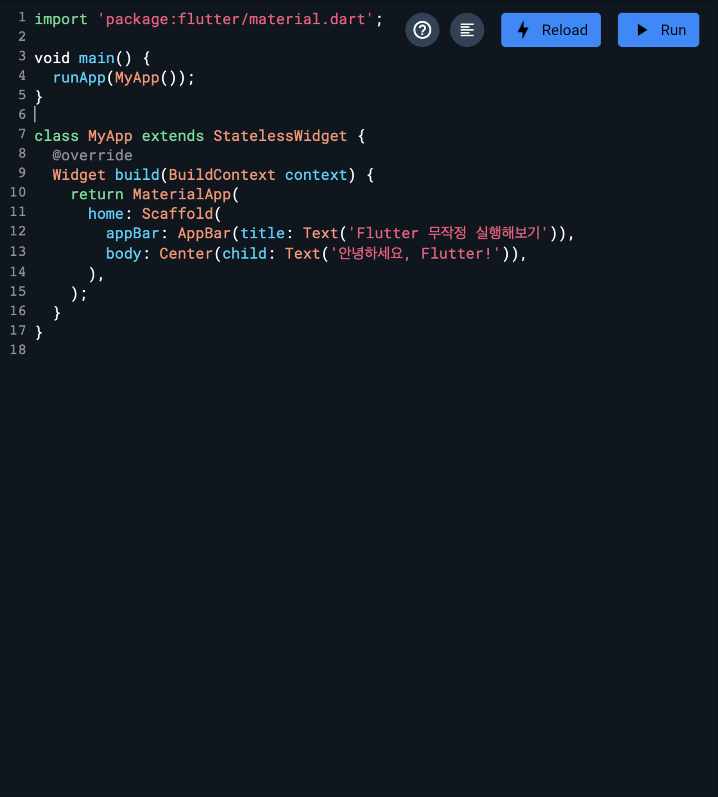
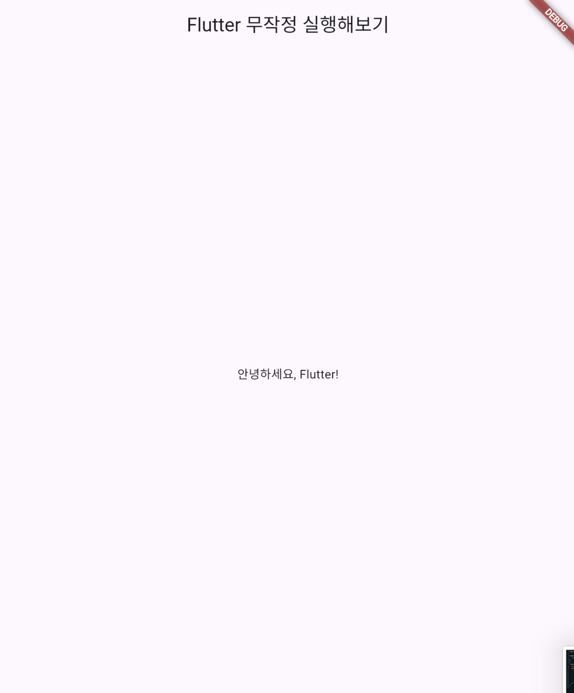

# Flutter 무작정 실행해보기


>“복잡함을 통제하려면, 우선 흐름을 이해해야 한다.” — 노자


Dart 언어와 마찬가지로, 무작정 실행해보기 챕터를 준비하였다. 아무것도 모르는 상태에서 코드를 실행 해보고, 결과를 확인하는 것만으로도 Flutter의 기본적인 구조를 파악할수 있을 것이다. 만약 이해가 안된다고 해서 걱정할필요는없다. 뒤이어 진행될 챕터에서 자세하게 차근차근 전부 설명할 예정이다.

만찬가지로 예제 코드의 구현은 DartPad 에서 충분히 실행할수 있다.

>DartPad : https://dartpad.dev

DartPad에 접속하고 아래의 코드를 복사, 붙여넣기 한 후, 실행 버튼을 눌러보자. 

```dart
import 'package:flutter/material.dart';

void main() {
  runApp(MyApp());
}
class MyApp extends StatelessWidget {
  @override
  Widget build(BuildContext context) {
    return MaterialApp(
      home: Scaffold(
        appBar: AppBar(title: Text('Flutter 무작정 실행해보기')),
        body: Center(child: Text('안녕하세요, Flutter!')),
      ),
    );
  }
}
```




정상적으로 실행이 완료되었다면, 화면에 "안녕하세요, Flutter!"라는 텍스트가 표시된 앱을 볼 수 있을 것이다. 이 예제는 Flutter의 기본 구조를 보여주는 간단한 앱이다.


이번에는 Text의 내용을 변경해보자. 자유롭게 문자를 변경하고, 어디가 어떻게 변경되는지 눈으로 직접 확인해본다. 여러번 다시 실행해보며, 감을 익혀보자.

```dart
import 'package:flutter/material.dart';

void main() {
    runApp(MyApp());
}
class MyApp extends StatelessWidget {
  @override
  Widget build(BuildContext context) {
    return MaterialApp(
      home: Scaffold(
        appBar: AppBar(title: Text('여기가 제목인가?')),
        body: Center(child: Text('첫 실행은 언제나 설레임!')),
      ),
    );
  }
}
```


이번에는 버튼을 만들어서 콘솔창에 출력해보는 예제이다. 아직은 뭐가 뭔지 잘 모르겠지만, 우리의 목적은 그냥 일단 실행해보는것이다.

```dart
import 'package:flutter/material.dart';

void main() {
    runApp(MyApp());
}
class MyApp extends StatelessWidget {
  @override
  Widget build(BuildContext context) {
    return MaterialApp(
      home: Scaffold(
        appBar: AppBar(title: Text('여기가 제목인가?')),
        body: Center(
            child: ElevatedButton( // 버튼을 추가합니다.
                onPressed: () {
                    // 버튼이 눌렸을 때 콘솔에 출력하도록 작성
                    print('버튼이 눌렸습니다!'); //우리가 잘 아는 코드이다.
                },
                child: Text('나를 눌러보세요!'), //버튼의 텍스트
            ),
        ),// 괄호 열고 닫고를 주의하자.
      ), //어딘가에서 열었으면
    ); //반드시 닫아야 한다.
  }
}
```


버튼을 눌렀다면, 아래와 같이 출력될것이다.

```dart
버튼이 눌렸습니다!
```

Flutter에 대한 아무 지식도 없는 상태에서, 무작정 코드를 작성하고 기본 구조를 파악하고, 실행해보는 시간을 가졌다. 이게 도대체 무슨 코드인지 모르겠다고 말하는게 정상이다. 만약 첫 실행부터 이해가 된다면, 이 책을 당장 덮고, 실전에 투입되는게 시간과 에너지를 아끼는 방법일 것이다. 이제부터 본격적으로 Flutter의 구조, 위젯, 상태 등의 배경지식을 이해하고 이것을 통해 실제로 동작하는 앱을 만들어보자.