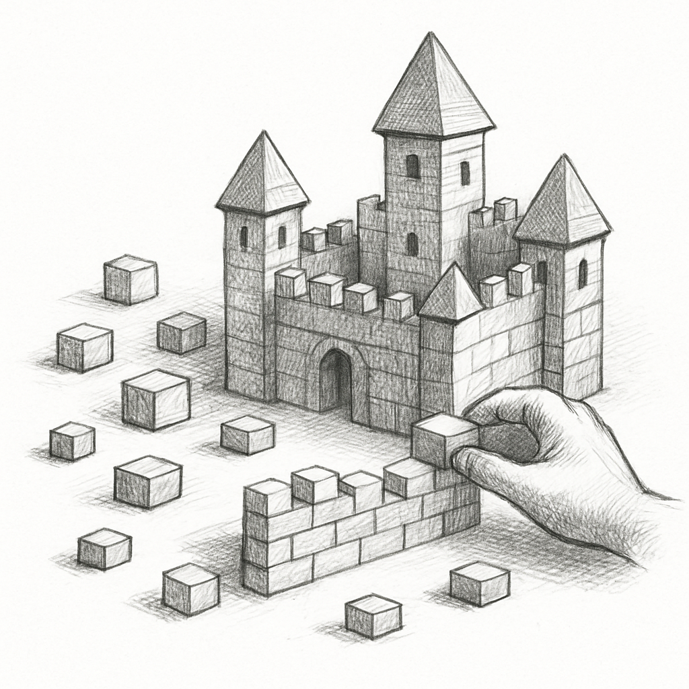

# **위젯이란?**





>“위대한 일은 충동이 아니라,
작은 것들의 조합으로 이루어진다.”— 빈센트 반 고흐


첫 시간은 Flutter의 핵심인 'Widget' 에 대해 알아보는 시간이다. 이해를 돋기 위해 우리의 일상을 잠시 들여다 보자. 때로는 앱이나 웹사이트를 볼 때, 단순한 화면이라기보다 정교하게 잘 만들어진 하나의 작품처럼 느껴질 때가 있다. 사실 보이지 않지만, 그 속에는 수 많은 코드 조각, 라이브러리, 리소스, 로직들이 유기적으로 결합되어 하나의 완성된 결과물을 만들어낸 것이다. 앞으로 이 책에서는 그 완성된 결과물, 즉 우리가 눈으로 보는 전체 화면을 UI(User Interface) 라고 부르도록 한다. 하지만 이 UI는 단번에 뚝딱 만들어지는 것이 아니다. 수많은 작은 조각들이 모여 결과적으로 큰 그림이 완성되는 형태이다. (작은 블록을 하나하나 쌓아올려 만든 '레고'성처럼 생각해도 좋다.) 이 UI조각 하나하나를 Flutter에서는 ‘위젯(Widget)’ 이라고 부른다. 위젯을 잘 만들고 조합하는 것, 그것이 곧 Flutter에서 매번 해야할 일이다.

만약 Flutter에 위젯이 없으면 아무 화면도 만들 수 없다. 우리가 보는 앱의 모든 화면들은 기본으로 제공되는 번들 위젯들과, 개발자가 직접 만든 커스텀 위젯들이 조합된 결과물이다. 버튼, 이미지, 텍스트 등 Flutter에서는 모든 것이 위젯으로 표현된다. 즉, Flutter로 앱을 개발한다는 것은 곧 위젯을 잘 만들고, 잘 조합하는 능력을 의미한다.

## **Flutter의 두 가지 위젯**
Flutter에서 위젯은 크게 두 가지 유형으로 나뉜다. 바로 'StatelessWidget'과 'StatefulWidget'이다. 이 두 가지는 Flutter UI 구성의 핵심 개념으로, 각 위젯이 화면에서 어떻게 동작하고, 어떤 역할을 하는지를 이해하기 위해 반드시 알고 넘어가야 할 중요한 요소이다. StatelessWidget은 변화하지 않는 정적인 화면을 구성할 때 사용되고, StatefulWidget은 사용자 입력이나 데이터 변경 등 상태의 변화에 따라 화면을 동적으로 갱신할 수 있는 위젯이다. 

### **StatelessWidget**
Flutter는 굉장히 직관적인 네이밍을 사용한다. 우선은 이름을 보고 유추해보도록 하자.

>state(상태) + less(~없다) = 상태가 없는 위젯?

Flutter에서는 화면에 표시되는 정보를 ‘상태(state)’라는 개념으로 관리한다. 이러한 상태정보는 화면에 직.간접적으로 사용되며, 서로 매우 밀접한 관계를 가지고 있다. 하지만 StatelessWidget 은 말 그대로 “상태가 없는 위젯”이다. 즉, 상태값이 변해도 스스로 화면을 갱신할 수 없는 정적인 화면을 구성하는 데 사용된다. 예를 들어 앱에 고정된 로고, 설명 문구, 단순히 한 번 보여주고 끝나는 텍스트 등과 같은 요소들은 상태를 관리할 필요가 없다.

>**[팁&노트]**
Flutter에서 ‘상태’란 쉽게말해 시간에 따라 변할 수 있는 값(또는 정보)을 의미하며, StatelessWidget은 그러한 변화와 무관한, 변하지 않는 화면(UI) 을 구성할 때 사용된다.

StatelessWidget 위젯을 만드는 방법은 그리 어렵지 않다. StatelessWidget 을 상속받기만 하면 된다. 아래의 예제를 살펴보자.

```dart
class Hello extends StatelessWidget { //StatelessWidget을 상속받는다.
  @override
  Widget build(BuildContext context) { //반드시 build() 메서드를 오버라이드 해야한다.
    return Text('Hello!'); //화면에 표시될 Text 위젯을 작성한다.
  }
}
```

기본적으로 클래스를 정의하고 StatelessWidget을 상속받은 뒤, build() 메서드를 오버라이드하면 끝이다. 이때 Text('Hello!')는 언제나 동일한 값을 표시하며, 만약 값이 바뀌더라도(중간에 발생한 이벤트에 의해) 이 StatelessWidget 위젯 자체는 화면을 갱신할 능력이 없다. 즉, 상태 변화에 반응하지 않는 구조인 것이다.

다시 말해 StatelessWidget은 정적인 화면, 즉 변화가 없는 UI 구성 요소를 작성하기에 적합한 위젯이다. 상태가 변해도 갱신 처리할 방법이 없기 때문에, 단순 출력용 위젯이나 한 번 보여주고 끝나는 정보에 주로 사용된다.

### **StatefulWidget**

이번에는 StatelessWidget과 반대되는 개념인 StatefulWidget에 대해 살펴본다. 먼저 이름을 그대로 해석해본다.

**state(상태)** + **ful(~가득한, 가지고 있는)** = **상태를 가지고 있는 위젯**


앞서 StatelessWidget에서는 한 번 정해진 값만을 표시하고, 그 이후에는 값이 바뀌어도 화면을 갱신하지 못한다고 했다. 하지만 실무에서는 사용자의 입력, 네트워크 통신, 센서 값 등 다양한 상황에 따라 화면이 바뀌어야 할 때가 많다. 버튼을 누르면 숫자가 올라가야 하고, 새로운 데이터를 받아오면 화면이 갱신돼야 하며, 체크박스를 누르면 상태가 바뀌어야 하는 경우들이다. 이처럼 시간에 따라 변화하는 데이터(상태)를 다루기 위해서는, 그 변화를 추적하고 반영할 수 있는 구조가 필요하다.

아래의 예제를 살펴보겠습니다. StatefulWidget은 StatelessWidget에 비해 조금 더 복잡하다. 변할 수 있는 상태값(state)을 내부에 보관하고, 그 값이 바뀔 때마다 화면을 다시 그려주는(build) 일련의 메커니즘이 필요하기 때문이다. 

우선은 extends StatefulWidget 하여 클래스를 작성해보자. 이때 반드시 createState() 메서드를 override 해줘야 한다.

```dart
class CounterPage extends StatefulWidget { // StatefulWidget을 상속받는다.
  @override
  _CounterPageState createState() => _CounterPageState(); //_CounterPageState 클래스를 생성하여 반환한다.
}
```

이어서 _CounterPageState 라는 상태클래스를 생성해보자. 우선은 State를 extends하고 build함수를 필수로 override 해야한다.

```dart
class _CounterPageState extends State<CounterPage> { //State 를 상속받고, 제네릭 타입으로 CounterPage를 지정한다.
  @override
  Widget build(BuildContext context) { // 반드시 오버라이드 해야한다.
	  //...
  }
```

이제 일종의 틀(뼈대)이 만들어졌고, 화면에 표시할 정보와, 버튼을 추가해보자. Scaffold, Center, Text 등 모르는 위젯들이 잔뜩 나와있지만, 우선은 가볍게 보고 지나가도록 한다.

```dart
class _CounterPageState extends State<CounterPage> {
  int counter = 0; // 화면에서 사용할 상태정보

  @override
  Widget build(BuildContext context) {
    return Scaffold(
      body: Center(
        child: Text('숫자: $counter'), // UI에 반영될 상태값
      ),
      floatingActionButton: FloatingActionButton( //사용자 상호작용을 위한 버튼구현
        onPressed: () { // 버튼이 눌렸을 때 실행
          setState(() { // 화면 갱신을 담당하는 특수한 함수
            counter++; // 상태값 변경
          });
        },
        child: Icon(Icons.add),
      ),
    );
  }
}
```

위 코드는 FloatingActionButton 버튼을 추가했고, 버튼을 눌렀을 때 setState() 라는 함수를 호출하여 상태값인 counter 변수를 변경하도록 작성되었다. setState 함수가 아직은 정확히 모르지만, 실행해보면 이 코드 덕분에 자동으로 UI가 갱신된다는 것을 알수 있다.(StatelessWidget과 대조적이다.)

단순한 StatelessWidget 구조와 다르게, StatefulWidget은 StatefulWidget, State 라는 두 가지 클래스를 만들어서 제공해야 한다는 점을 기억해야 한다.

```dart
class CounterPage extends StatefulWidget {
  @override
  _CounterPageState createState() => _CounterPageState();
}

class _CounterPageState extends State<CounterPage> {
  int counter = 0; //화면에 표시할 상태값

  @override
  Widget build(BuildContext context) {
    return Scaffold(
      body: Center(
        child: Text('숫자: $counter'), //counter 값이 UI에 반영된다.
      ),
      // FloatingActionButton을 추가하여 상태를 변경할 수 있는 버튼을 구현한다.
      floatingActionButton: FloatingActionButton(
        onPressed: () {
          setState(() { // 상태값을 변경할 때는 반드시 setState()로 감싸야 한다.
            counter++; //상태 변경
          });
        },
        child: Icon(Icons.add),
      ),
    );
  }
}
```


### AI와 함께 학습하세요
>Q. Flutter의 StatefulWidget과 StatelessWidget의 차이점이 무엇인가?


---

**Copilot을 통해 실습해보세요!**
**Copilot을 활용해보세요.**

Flutter의 UI는 위젯으로 구성되며, 대표적으로 `StatelessWidget`과 `StatefulWidget`이 있습니다.이번 실습에서는 정적인 UI를 먼저 만든 뒤, 상태가 변하는 동적인 구조로 확장해봅니다. 주석을 따라가며 Copilot의 자동완성을 활용해 빈칸을 채워보세요.


```dart
// 1) 정적인 UI: StatelessWidget
// 텍스트만 보여주는 고정된 화면을 만들어보세요.
class StaticHello extends /* 여기에 상속할 타입 작성 */ {
  @override
  Widget build(BuildContext context) {
    return Center(
      child: Text('안녕하세요!'),
    );
  }
}
```

```dart
// 2) 상태를 가질 수 있는 위젯: StatefulWidget 구조
// 클래스 이름은 CounterPage로 지정해보세요.
class CounterPage extends /* 여기에 상속할 타입 작성 */ {
	//createState를 통해 _CounterPageState 와 연결해보자.
}

// 3) State 클래스 만들기
// 상태를 보관하고 build()를 통해 UI를 구성합니다.
class _CounterPageState extends /* 여기에 상속할 타입 작성 */ {
  // 화면에 표시될 상태값 선언
  int counter = 0;

  @override
  Widget build(BuildContext context) {
    return Scaffold(
      appBar: AppBar(title: Text('클릭 카운터')),
      body: Center(
        // 상태값을 화면에 출력하세요.
        child: // 여기에 상태값을 출력하는 위젯 작성
      ),
      floatingActionButton: FloatingActionButton(
        onPressed: () {
          // 상태 변경 시 반드시 setState로 감싸야 합니다.
          setState(() {
            // 상태값을 증가시키는 코드를 작성하세요.
            //...
          });
        },
        child: Icon(Icons.add),
      ),
    );
  }
}
```

```dart
void main() {
  runApp(
    MaterialApp(
      home: /* StaticHello() 또는 CounterPage() 중 하나를 실행해보세요 */
    ),
  );
}
```

