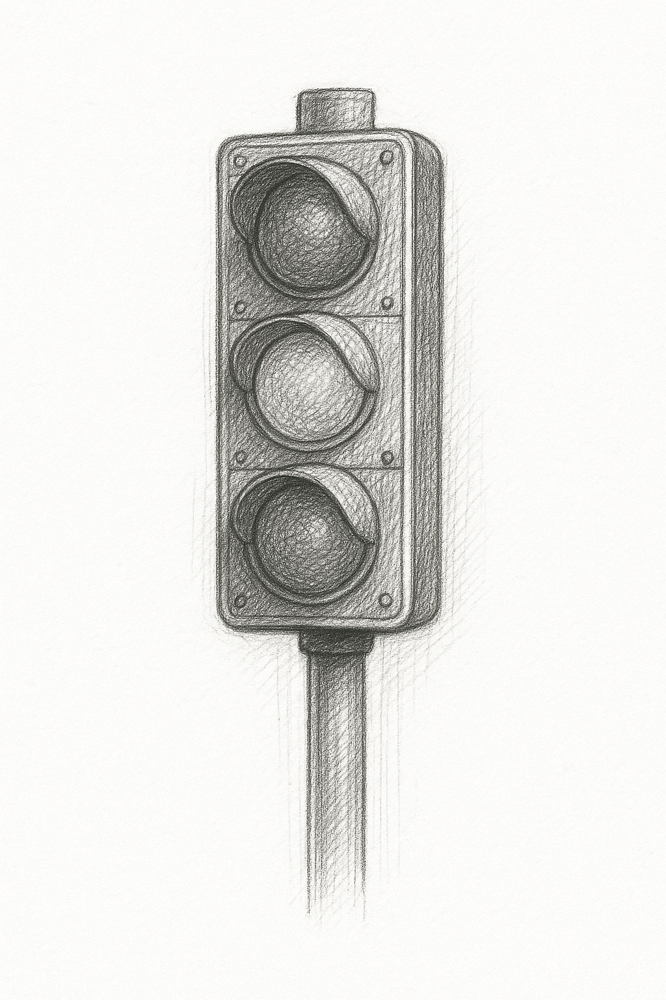

# **상태(State)**




>“디자인은 단지 보이는 것이 아니라,
어떻게 작동하는가이다.” — 스티브 잡스


상태란, 어떤 객체 내부에 존재하는 ‘변할 수 있는 데이터’를 의미한다. 여기서 가장 중요한 키워드는 바로 “변할 수 있다”는 점이다. 이것은 단순히 고정된 값이 아니라, 시간이나 상황에 따라 유동적으로 변할 수 있는 정보를 뜻한다. 이 개념은 Flutter에도 그대로  적용할수 있으며, 상태는 변수(variable)를 통해 표현할수 있다. 실제로 많은 앱에서는 버튼을 누르거나, 텍스트 필드에 입력을 하는등, 수많은 이벤트 들이 발생하고, 화면에 표시되는 정보가 바뀌는 경우가 흔하게 발생한다. 여기서 변화하는 정보가(값) 바로 상태이며, 이 상태들은 모두 변수에 저장된다.

**“조금 더 구체적으로 상상해 보자”**

예를 들어, 여기 빈 화면이 하나 있고, 그 화면 중앙에 1초마다 숫자가 하나씩 올라 간다고 생각해본다. 처음에는 1이 표시되고, 1초 후에는 2, 그 다음엔 3… 이런 식으로 숫자가 계속해서 변해간다면, 그 숫자는 단순한 값이 아닌 화면의 상태를 나타내는 정보인 것이다. 이런 상황을 실제로 구현해보며 좀더 살펴보자.

아래의 예제는 버튼을 눌러 값을 카운팅 하는 가장 기본적이고, 많이 활용되는 예제이다. 앱이 실행되면 main()함수가 호출되고, MyApp()이라는 위젯이 앱의 루트(최상단에)로 설정된다. Flutter는 항상 main -> runApp()으로 시작하며, 이 안에서 우리가 만든 위젯을 호출하는 형태이다.

```dart
void main() => runApp(MyApp());
```

이어서 MyApp 클래스를 작성합니다.

```dart
class MyApp extends StatelessWidget { //StatelessWidget 을 상속한다.
  @override
  Widget build(BuildContext context) { //build를 override 하는것은 필수이다.
    return MaterialApp(//안드로이드 디자인을 위한 MaterialApp 을 최상단에 배치 
      home: CounterApp(), //내가 작성할 위젯
    );
  }
}
```

MyApp은 StatelessWidget을 상속받아 build() 함수를 구현하고 있다. MaterialApp은 전체 앱의 틀을 잡아주는 위젯(안드로이드 디자인 기반)이고, 그 안에 home: 속성으로 실제 보여질 화면(CounterApp)을 지정해주고 있다. 이어서 아직 작성하지 않은 CounterApp의 작성코드를 살펴보자.

```dart
class CounterApp extends StatefulWidget {//StatefulWidget 로 상속했다.
//createState 를 반드시 override 해야한다.
  @override
  _CounterAppState createState() => _CounterAppState();
}
```

이 CounterApp은 StatefulWidget 이다. StatefulWidget을 상속하고 화면 안에서 상태(state)를 관리하기 위해 createState()를 override 한다. 이제 실제 상태를 관리할 클래스인 _CounterAppState를 생성 해야한다.(구조가 복잡하지만 조금만 더 알아보자.)

```dart
class _CounterAppState extends State<CounterApp> { //State 를 상속한다.
  int _counter = 0; //화면에 표시할 상태정보

  @override
  Widget build(BuildContext context) {
    return Scaffold( //Scaffold 위젯을 사용하여 화면 구조를 잡는다.
      appBar: AppBar(title: Text('버튼 클릭 카운터')), //상단 앱바

      body: Center(
        child: Text(
          '숫자: $_counter', //현재 상태값을 화면에 표시
          style: TextStyle(fontSize: 36),
        ),
      ),
      //floating action button
      //... 버튼을 눌렀을때 실행될 함수가 필요하다.

    );
  }

}
```

_counter는 현재 화면에 표시할 숫자정보를 담기위한 변수이며, 화면에서 버튼을 누를 때마다 값이 바뀌는 대상이 된다. 기본골격을 만들었으니, floatingActionButton 버튼을 추가하고 이벤트를 실행해보자. onPressed: 속성에 버튼을 눌렀을때 실행될 함수를 작성한다.

```dart
floatingActionButton: FloatingActionButton(
  onPressed: _incrementCounter, //버튼이 눌러졌을때 _incrementCounter 라는 함수가 호출된다.
  child: Icon(Icons.add),
  tooltip: '숫자 증가',
),
```

마지막으로 버튼을 눌렀을때 실행될 _incrementCounter 함수를 작성해보자.

```dart
void _incrementCounter() {
    setState((){
	    _counter++;
    });
}
```

Stateless와 Stateful 기반의 Coutner 예제가 완성되었다. 전체 코드를 살펴보고 직접 실행해보자.

```dart
import 'package:flutter/material.dart';

void main() => runApp(MyApp());

class MyApp extends StatelessWidget {
  @override
  Widget build(BuildContext context) {
    return MaterialApp(
      home: CounterApp(),
    );
  }
}

class CounterApp extends StatefulWidget {
  @override
  _CounterAppState createState() => _CounterAppState();
}

class _CounterAppState extends State<CounterApp> {
  int _counter = 0; // 상태로 관리할 값

  void _incrementCounter() {
     setState((){
	    _counter++; //버튼을 누르면 _counter 값이 증가된다.
    });
  }

  @override
  Widget build(BuildContext context) {
    return Scaffold( // Scaffold는 UI 구조를 제공하는 일종의 틀이라고 생각하면 된다.

      //상단에 배치되는 가로바 형태
      appBar: AppBar(title: Text('버튼 클릭 카운터')),

      //body: 에 UI에 표시될 메인 위젯들을 추가한다.
      body: Center(
        child: Text(
          '숫자: $_counter', //_counter 상태변수를 화면에 표시 하려고 한다.
          style: TextStyle(fontSize: 36),
        ),
      ),
      floatingActionButton: FloatingActionButton(
        //버튼을 누르면 _incrementCounter 함수가 호출된다. 
        onPressed: _incrementCounter,
        child: Icon(Icons.add),
        tooltip: '숫자 증가',
      ),
    );
  }
}
```

코드를 자세히보면 _incrementCounter 함수 내부에 setState()라는 특별한 메서드가 보인다. 이 메서드를 호출하면 플러터 시스템은 현재 위젯의 상태가 변경되었음을 감지하고, build()메서드를 다시 호출한다. 이에 따라 화면이 다시 그려지고(갱신), 최종적으로 변경된 상태값이 반영된 UI가 사용자에게 보여지게 되는 것이다. 이러한 일련의 과정을 통해 우리는 버튼을 누를 때마다 숫자가 증가하는 동적인 화면을 만들 수 있게 된다. 즉, 위 코드처럼 내부적으로 상태를 저장하고, 변화에 따라서 화면을 갱신할 여지가 있다면, StatelessWidget이 아니라 StatefulWidget으로 작성되어야 하는 것이다.


### AI와 함께 학습하세요
>Q. “Flutter의 StatefulWidget으로 화면을 구성할때, setState() 함수를 반드시 호출해야 할까?

---


## 심화학습
**‘화면을 갱신한다.’ ‘다시 그린다’ 는 무슨 의미 일까?**

‘화면을 다시 그린다’ 는 표현은 일상에서 한 번도 생각해본 적 없는 추상적인 개념이다. 그렇기 때문에 문서나 설명만 봐서는 이해가 잘 되지 않는 부분이 있다. 그럴 때 가장 좋은 방법은, 직접 실험해 보는 것이다.

**화면갱신**
직접적인 코드를 통해 살펴보겠습니다. 아래의 코드는 StatefulWidget로 UI를 작성할때, 화면 갱신을 위한 핵심 코드이다.

```dart
//코드 예제
setState(){
	counter++;
}
```

어렵게만 보이는 위 코드가 하는 일은 의외로 단순하다.
setState는 마치 "플러터님 상태가 바뀌었어요" 라고 Flutter 에 알려주는 격이다. 그럼 Flutter 시스템이 말한다. “아! 그럼 화면을 다시 그려야겠군요!” 그리고 나서, 화면은 변경된 상태값으로 다시 그려지며 마침내 화면에 숫자가 표시되는 것이다.


이번에는 눈으로 직접 확인해보면서, 이해를 돕도록 한다. 기작성된 예제를 가져와서 실험을 해본다.

```dart
//State 코드 예제
int count = 0; // 상태값 변수

void _increment() {
  //setState((){ setState를 주석처리 하고 실행해보자.
    count++;
  //}
}
```

작성된 코드의 setState 구문을 지우고(또는 주석), 실행해 보자. 왠일인지 버튼을 눌러도 화면에는 아무 반응이 없을 것이다. 분명히 코드상의 변수 count 의 값을 증가시켰지만, 화면은 바뀌지 않게 된다. 

**"왜 그럴까?"**
Flutter 시스템은 우리가 아무리 버튼을 눌러도 ‘상태가 바뀐 줄 모르기 때문’이다.

```dart
int count = 0; //상태 변수

void _increment() {
  setState(() { //setState를 추가하여 실행해보자.
    count++;
  });
}
```

이번에는 다시 setState를 추가 하고 count값이 증가하는 코드를 작성하였다. 실행해보면 정상적으로 버튼 이벤트에 따라서 화면에 변경된 값이 정확하게 표시되는걸 볼수 있다.


---
## **Copilot을 통해 실습해보세요!**
**Copilot을 활용해보세요.**
상태가 필요한 간단한 UI를 만들어봅시다. **버튼을 누르면 숫자가 증가**하는 앱을 작성해보세요. 단, 이 앱은 상태 변화가 있으므로 `StatelessWidget`이 아닌 `StatefulWidget`으로 구성되어야 합니다.


```dart
import 'package:flutter/material.dart';

//시작은 언제나 main()이다.
void main() => runApp(MyApp());

// 체크! 이 앱은 상태값이 필요한 앱 입니다.
class MyApp {
  @override
  Widget build(BuildContext context) {
    return MaterialApp(
      home: CounterScreen(), // 메인화면
    );
  }
}

// 상태를 가질 수 있는 위젯으로 작성해보세요.
class CounterScreen extends /* 여기에 위젯 타입 작성 */ {
  // createState를 override하고
  //_CounterScreenState를 연결해주세요.
}

// 상태를 관리할 State 클래스입니다.
class _CounterScreenState extends /* 여기에 상속할 타입 작성 */ {
  // 현재 숫자를 저장할 변수 선언
  int _count = 0;

  // 버튼을 눌렀을 때 실행될 함수
  void _increase() {
    // 상태가 바뀔 때 setState를 반드시 작성해야 합니다. (UI 갱신 관련)
    setState(() {
      _count++;
    });
  }

  @override
  Widget build(BuildContext context) {
    return Scaffold(//Scaffold를 최상단에 배치

      appBar: AppBar(title: Text('숫자 증가 예제')),

      body: Center(
        // _count 상태값을 화면에 표시해보세요.
        child: //Text(...)
      ),

      floatingActionButton: FloatingActionButton(
        // 버튼을 누르면 _increase 함수가 실행되도록 작성하세요.
        onPressed: //...
        child: Icon(Icons.add),
        tooltip: '숫자 증가',
      ),
    );
  }
}
```

---
