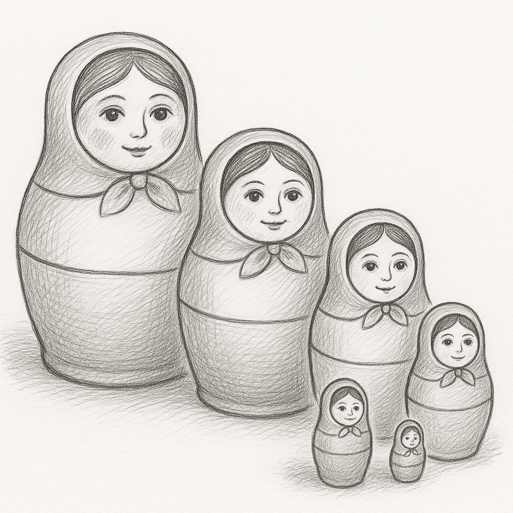

# **플러터의 위젯배치 방식**




>“질서는 모든 아름다움의 전제다.” — 에드먼드 버크


러시아의 유명한 전통 인형,”마트료시카(Matryoshka)” 를 아는가? 겉보기에는 그냥 예쁜 하나의 인형처럼 보이지만, 굉장한 비밀이 숨겨져있다. 인형을 하나씩 열어보면 그 안에는 점점 더 작고 귀여운 인형들이 차례차례 숨어있다.

>**[팁&노트]**
1890년대 러시아에서 처음 만들어진 마트료시카 인형은 가족, 다산, 모성애의 상징으로 여겨진다. 가장 큰 인형은 어머니를, 그 안에 있는 작은 인형들은 자녀를 의미하며, 세대를 이어가는 전통의 연결 고리를 표현한다. [^1]

“그런데 왜 갑자기 인형 얘기를 하는지...” 바로 Flutter의 위젯 구조가 이 마트료시카 인형과 너무 닮았기 때문이다. 앞서 예제를 구현해 봤다면 단번에 이해했을 것이다. Flutter는 화면에 무엇인가를 표시하고자 할 때, 단일 위젯만 사용하는 게 아니라 위젯 안에 또 다른 위젯을 계속해서 포개듯 중첩하여(wrapping) 구조를 만든다. 작은 위젯이 큰 위젯 안에 들어가고, 또 그 위젯이 다른 위젯 안에 포함되는 구조, 이게 바로 플러터에서 화면을 만들어나가는 방식이다.

## **랩핑(Wrapping) – 감싸고 또 감싸는 위젯의 세계**

Flutter에서는 위젯을 감싸고 또 감싸는 형태가 기본 구조이다. 각각의 위젯은 작고 명확한 역할만을 수행하고, 이 작은 위젯들이 계층적으로 쌓여서, 하나의 복합 UI를 만들어낸다. 마치 블록놀이 처럼 하나씩 쌓아 올리며 원하는 모양의 구조물을 만드는 방식과 유사하다고 볼수 있다.

예를 들어, 아래의 코드는 ListView라는 위젯을 사용하여 세로 스크롤이 가능한 목록을 만들고, 그 안에 여러 개의 ListTile(각각의 아이템) 위젯을 배치한 구조이다. 각 ListTile은 내부적으로 아이콘과 텍스트로 구성되어 하나의 리스트 항목을 표현한다.

```dart
ListView(
  children: <Widget>[
    ListTile(
      leading: Icon(Icons.map),
      title: Text('Map'),
    ),
    ListTile(
      leading: Icon(Icons.photo_album),
      title: Text('Album'),
    ),
    ListTile(
      leading: Icon(Icons.phone),
      title: Text('Phone'),
    ),
  ],
)
```

겉으로 보기에는 간단해 보이지만, 이 구조는 다음과 같은 위젯트리(계층구조)를 형성하고 있다.

```dart
ListView
 ├─ ListTile
 │   ├─ Icon
 │   └─ Text
 ├─ ListTile
 │   ├─ Icon
 │   └─ Text
 └─ ListTile
     ├─ Icon
     └─ Text
```

Flutter에서는 내부적으로 이렇게 위젯을 포개어 감싸고 조립하는 방식을 통해, 복잡한 UI도 작고 단순한 블록 단위로 구현할 수 있는 것이다. 이 위젯들의 구조는 마치 나무(Tree)처럼 뻗어나가는 형태로 시각화할 수 있으며, 이를 위젯트리(위젯계층구조)라고 부른다. 내부의 이런 구조를 잘 이해하고 있다면, 향후 복잡한 화면도 쉽게 분석하고 구성할 수 있게된다.


## **좀 더 복잡한 예시 – 감싸고 꾸미고 또 감싸기**
앞에서 배운 기본 구조를 바탕으로, 이번에는 실제 앱에서 자주 보게 될 복합적인 위젯 구조를 살펴보자. Flutter에서는 하나의 화면을 구성할 때 단순한 위젯 하나만 사용하는 경우는 거의 없다. 대부분은 기능+디자인 +반응성 등이 어우러진 형태로, 여러 위젯을 겹겹이 감싸서 만들어 진다.

```dart
ListView( //목록 형태의 구조를 표현할때 자주 사용한다.
  padding: EdgeInsets.all(16),//약간의 간격을 준다.
  children: <Widget>[ //child가 아닌 children 임에 주목하자. 여럿 위젯들을 추가할수 있다는 뜻이다.
    Card( //카드 형태의 표현을 위한 위젯

      //color 및 각종 옵션값을 조정한다.
      color: Colors.blue.shade50,
      elevation: 4,
      shape: RoundedRectangleBorder(
        borderRadius: BorderRadius.circular(12),
      ),

      child: InkWell(
        onTap: () { //해당 아이템이 터치된 경우 처리 할 내용을 작성한다.
          print('카드 클릭됨!');
        },
        child: Padding(
          padding: const EdgeInsets.all(16.0),
          child: ListTile(
            leading: Icon(Icons.favorite, color: Colors.red),
            title: Text('좋아요'),
            subtitle: Text('이 버튼을 누르면 좋아요가 눌립니다.'),
            trailing: Icon(Icons.arrow_forward_ios),
          ),
        ),
      ),
    ),

    //...

  ],
)
```


기능적으로는 특별한게 없는 이 코드는 다소 복잡하게 보였을 것이다. 화면상에 단순하게 보여지는 위젯이라도 내부적으로는 다양한 위젯으로 감싸고, 기능성, 디자인, 반응성까지 모두 포함하고 있다는걸 알수있다. (이해를 돕기 위한 복잡한 예제이다)

- Card → 카드형 UI 틀 제공
- InkWell → 터치 시 반응 효과 부여
- Padding → 여백 적용
- ListTile → 실제 내용 구성
- 내부 위젯은 또 Icon, Text, subtitle, trailing 등으로 구성

복잡해 보이지만 트리구조(계층구조)를 파악하면 한눈에 이해할수 있다. (최종적으로는 코드를 보고 이 트리가 머릿속에 그려지면 더 좋다.) 

```dart
ListView
└─ Card
   └─ InkWell
      └─ Padding
         └─ ListTile
            ├─ leading: Icon
            ├─ title: Text
            ├─ subtitle: Text
            └─ trailing: Icon
```

아래의 전체 코드를 보며 한번더 실행해보자. 화면에 보이는 큰 그림이, 사실은 작은 조각들로 만들어져 있었다는 사실을 이제는 자연스럽게 이해할수 있을것이다.

```dart
import 'package:flutter/material.dart';

//언제나 시작은 main() 이다.
void main() {
  runApp(MyApp());
}

//StatelessWidget 를 상속한다.
class MyApp extends StatelessWidget {
  @override
  Widget build(BuildContext context) {
    return MaterialApp(
      title: 'Card UI 예제',
      theme: ThemeData(
        primarySwatch: Colors.blue,
      ),
      home: HomePage(), // 홈 위젯 설정
    );
  }
}

// 목록을 표시하는 정적인 화면이기 때문에
// StatelessWidget 를 상속한다.
class HomePage extends StatelessWidget {
  @override
  Widget build(BuildContext context) {
    return Scaffold(
      appBar: AppBar(
        title: Text('위젯 래핑 예제'),
      ),
      body: ListView( //위에서 작성된 ListView 적용
        padding: EdgeInsets.all(16),
        children: <Widget>[
          Card(
            color: Colors.blue.shade50,
            elevation: 4,
            shape: RoundedRectangleBorder(
              borderRadius: BorderRadius.circular(12),
            ),
            child: InkWell(
              onTap: () {
                print('카드 클릭됨!');
              },
              child: Padding(
                padding: const EdgeInsets.all(16.0),
                child: ListTile(
                  leading: Icon(Icons.favorite, color: Colors.red),
                  title: Text('좋아요'),
                  subtitle: Text('이 버튼을 누르면 좋아요가 눌립니다.'),
                  trailing: Icon(Icons.arrow_forward_ios),
                ),
              ),
            ),
          ),
        ],
      ),
    );
  }
}
```


---

[^1] Wikipedia – Matryoshka doll : https://en.wikipedia.org/wiki/Matryoshka_doll