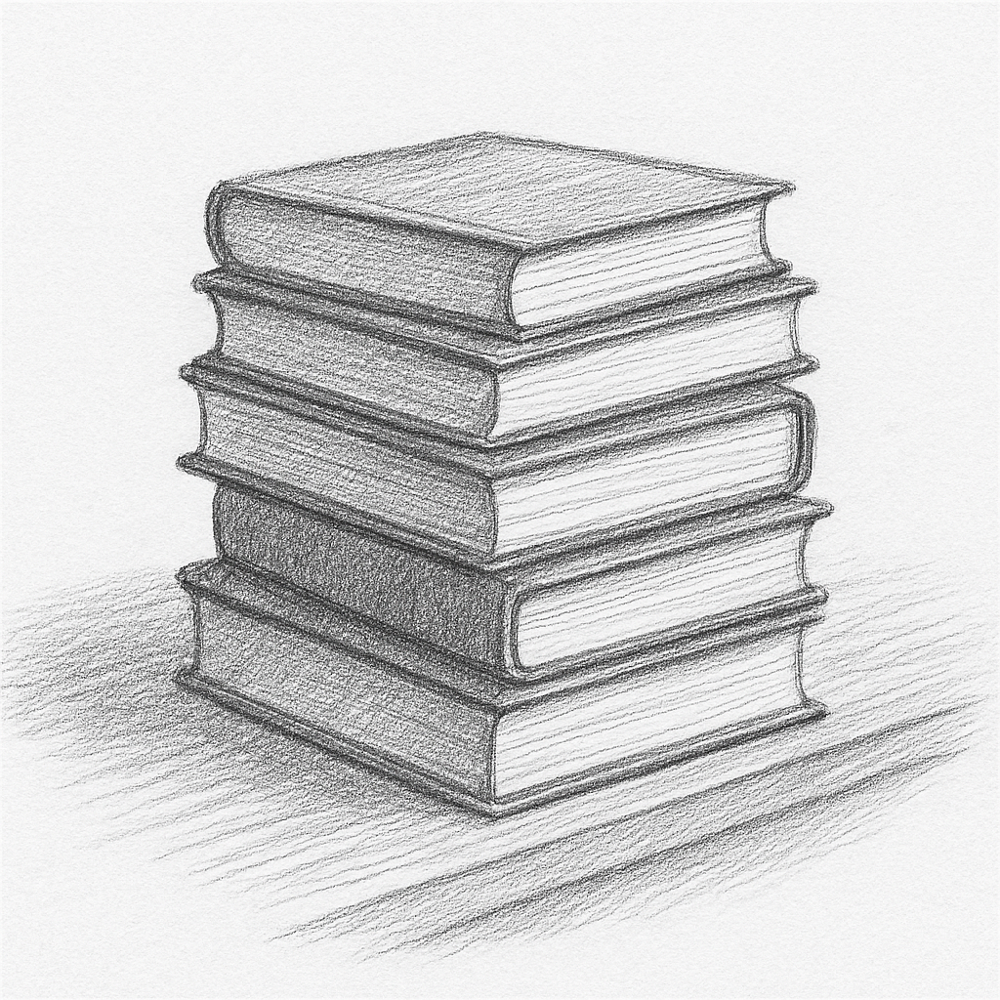

# 화면전환


>“모든 길은 어디론가 향한다.
하지만 방향을 정하는 것은 당신이다.”— 루이스 캐럴 (『이상한 나라의 앨리스』)


우리가 만들고자 하는 앱은 분명 화면을 하나만 가지고 있는, 그런 단순한 앱이 아닐것이다. 지금 당장 아무 앱이든 실행해보자. 장담하건데 단일 화면(하나의 화면만으로 동작)을 가진 앱은 없을것이다. 하나의 화면은 또다른 화면으로 이어지고, 다시 이 화면은 또다른 화면으로 전환되며, 사용자와 끊임없이 상호작용하는것. 이러한 동작은 선택이 아닌, 필수 조건이라고 할수 있다. 


## 화면전환의 기본 
### Navigator.push
Flutter에서는 Navigator와 Route 개념을 이용해 화면을 전환한다. 기본적인 화면 전환은 Navigator.push() 와 Navigator.pop() 을 통해 구현하면 된다. 아래의 예제를 살펴보자.

```dart
Navigator.push(
  context,
  MaterialPageRoute(builder: (context) => SecondPage()),
);
```
Navigator.push()는 새로운 화면을 스택이라고 하는 일종의 화면 관리를 위한 데이터 구조에 밀어넣는(push) 동작이다. 또한 MaterialPageRoute는 새 페이지(SecondPage)로 이동하기 위한 경로(Route)를 생성한다.

>**[팁&노트]**
Flutter의 Navigation 처리 즉 화면이동과 관련하여 내부적으로 ‘스택(Stack)’ 이라는 자료구조를 사용한다. 화면을 이동할때는 해당 화면을 push 하여 쌓고, 다시 뒤로 돌아갈 때는 꺼내서(pop) 이전 화면으로 이동하는 구조이다. (안드로이드, ios 또한 이와 유사한 stack 기반의 구조로 설계 되어있다.)





### 다시 돌아올때는 Navigator.pop
디바이스의 Back 버튼을 눌러서 화면이 이전 화면으로 돌아가는 것(많이 경험해 봤을 것이다.) 그것이 pop 동작 이다. push와 마찬가지로 pop도 많은 코드를 작성할 필요없이 간결하다.

```dart
Navigator.pop(context);
```

pop()을 호출하면 현재 페이지(눈으로 보고있는)가 스택 상단에서 제거되며, 그 아래 깔려있던 이전 화면이 나타나게 된다. 보통 Android 디바이스의 뒤로 가기 버튼이 전형적인 pop()으로 동작하는 경우이다. 전체 코드를 통해, 어떻게 화면을 전환하고, 다시 돌아오는지 살펴보자. 


**전체코드**

```dart
import 'package:flutter/material.dart';

void main() {
  runApp(MyApp());
}

//StatelessWidget 를 상속하여 최상위 위젯을 정의한다.
class MyApp extends StatelessWidget {
  @override
  Widget build(BuildContext context) {
    return MaterialApp( // 안드로이드 기반 디자인를 기준으로 앱을 구성한다.
      home: FirstPage(),
    );
  }
}

//StatelessWidget 을 상속하여 첫번째 페이지를 정의한다.
// 기본적인 구조만을 가지고 있고, 버튼을 누르면 두번째 페이지로 이동한다.
class FirstPage extends StatelessWidget {
  @override
  Widget build(BuildContext context) {
    return Scaffold(
      appBar: AppBar(title: Text('First Page')),
      body: Center(
        child: ElevatedButton(
          onPressed: () {
            Navigator.push( //Navigator.push 를 통해 두번째 페이지로 이동한다.
              context,
              MaterialPageRoute(builder: (context) => SecondPage()),
            );
          },
          child: Text('Go to Second Page'),
        ),
      ),
    );
  }
}

// StatelessWidget 을 상속하여 두번째 페이지를 정의한다.
// 두번째 페이지는 버튼을 누르면 다시 첫번째 페이지로 돌아간다.
class SecondPage extends StatelessWidget {
  @override
  Widget build(BuildContext context) {
    return Scaffold(
      appBar: AppBar(title: Text('Second Page')),
      body: Center(
        child: ElevatedButton(
          onPressed: () {
            //다시 push 하는것이 아닌, pop을 호출하여 이전 페이지로 돌아간다.
            //Navigator.push(
            //context,
            //MaterialPageRoute(builder: (context) => FirstPage()),
            //);
            Navigator.pop(context);
          },
          child: Text('Back to First Page'),
        ),
      ),
    );
  }
}

```

## **Named Route 사용**
Navigator.push 동작의 경우 Page 클래스를 직접적으로 언급해야 하기 때문에 불편할수도 있다. 이번에는 특정 이름을 부여해서 간단하게 이동 처리 해보자. pushNamed 라는 함수를 호출했고, 두번째 파라미터로 “/second” 를 추가하였다.

```dart
Navigator.pushNamed(context, "/second");
```
이렇게 하면, 두번째 페이지로 이동할때, MaterialPageRoute를 직접 작성하지 않아도 된다. 대신, 앱의 라우팅을 정의하는 부분이 필요한데 이동 관련 세부 내용을 MaterialApp 안에 정의할수 있다.

```dart
MaterialApp(
  title: 'Flutter Navigator Example',
  theme: ThemeData(
    primarySwatch: Colors.blue,
  ),
  //home: FirstPage(), // 첫번째 페이지를 home으로 설정
  initialRoute: '/home', // 초기 라우트 설정
  routes: {// 화면이동처리에 관련된 상세 내역을 작성
    '/home': (context) => FirstPage(), // '/home' 이라는 네이밍으로 경로 이동시, FirstPage() 를 화면에 표시한다.
    '/second': (context) => SecondPage(),// '/second' 이라는 네이밍으로 경로 이동시, SecondPage() 를 화면에 표시한다.
  },
);
```

```dart
routes: {
    '/home': (context) => FirstPage(), 
    '/second': (context) => SecondPage(),
  },
```

routes 를 자세히 보면 어디서 많이 본 중괄호('{ }')가 보인다. 이미 추측 했을수도 있겠지만, 이 부분은 key,value로 만들어진 Map 데이터 형식인 것이다. '/home'이 key이고, : 뒤에있는 (context)=>FirstPage()가 value 이다. (즉 내부적으로 routes는 Map<String, WidgetBuilder> 형식으로 페이지 경로를 정의하고 있다.)


## 주요 함수들
이외에도 다양한 함수들을 제공한다. 위젯소개와 마찬가지로 이 책에서 이런 동작을 전부다 살펴보는것은 의미가 없다. 자주 사용되는 몇가지 함수들을 살펴보자.

**pushReplacement**
앞서 이야기 했듯 화면전환과 관련된 데이터 구조상(Stack) push, pop이 기본 동작이다. 때로는 화면을 새로 밀어 넣는것(화면 이동) 뿐만 아니라, 스택 상단에 위치하는 페이지를 다른 페이지로 교체하는 동작이 필요할때도 있다. 즉 pop과 push가 한번에 일어나는 형태이다.

```dart
Navigator.pushReplacement( //pushReplacement 를 통해 페이지를 교체한다.
  context,
  MaterialPageRoute(builder: (context) => FirstPage()),
);
```

**pushAndRemoveUntil**
pushAndRemoveUntil는 페이지를 단순히 교체하는 것에서 벗어나, 조건에 의한 좀 더 복잡한 이동처리가 필요할때 사용할수 있다. 기본적으로는 기존에 있던 페이지를 모두 제거하고, 새로운 페이지를 밀어넣는 동작을 처리한다.

```dart
import 'package:flutter/material.dart';

void main() {
  runApp(MyApp());
}

//StatelessWidget 을 상속하여 최상위 위젯을 정의한다.
class MyApp extends StatelessWidget {
  @override
  Widget build(BuildContext context) {
    return MaterialApp(
      home: FirstPage(),
    );
  }
}

//FirstPage 를 정의한다.
// 첫번째 페이지는 버튼을 누르면 두번째 페이지로 이동한다.
class FirstPage extends StatelessWidget {
  @override
  Widget build(BuildContext context) {
    return Scaffold(
      appBar: AppBar(title: Text('First Page')),
      body: Center(
        child: ElevatedButton(
          onPressed: () {
            Navigator.push(//Navigator.push 를 통해 두번째 페이지로 이동처리
              context,
              MaterialPageRoute(
                  builder: (context) => SecondPage(),
                  settings: RouteSettings(name: "SecondPage")),
            );
          },
          child: Text('Go to Second Page'),
        ),
      ),
    );
  }
}


// SecondPage 를 정의한다.
// 두번째 페이지는 버튼을 누르면 첫번째 페이지로 이동하며, 
// 스택에 쌓여있는 이전 페이지들을 전부 제거 하고, 새로운 페이지를 밀어넣는다.
class SecondPage extends StatelessWidget {
  @override
  Widget build(BuildContext context) {
    return Scaffold(
      appBar: AppBar(title: Text('Second Page')),
      body: Center(
        child: ElevatedButton(
          onPressed: () {
            Navigator.pushAndRemoveUntil(//pushAndRemoveUntil 를 통해 첫번째 페이지로 이동처리         
                context, MaterialPageRoute(builder: (context) => FirstPage()),
                (Route<dynamic> route) { // route에 따라서 제거할지 여부를 결정한다.
                  print('=== route : ${route.settings.name} ===');
                  return false; // return false 는 이전 페이지 제거를 의미
                });
          },
          child: Text('Go to First Page and Remove All'),
        ),
      ),
    );
  }
}


```

이렇게 하면, SecondPage에서 FirstPage로 이동할때, 스택에 쌓여있는 모든 페이지를 제거하고, 새로운 페이지를 밀어넣는 동작을 수행한다. 만약 아래와 같이 작성하면, 조건에 맞는 페이지 전환도 구현할수 있다.


```dart
(Route<dynamic> route) {
  print('=== route : ${route.settings.name} ===');
  if(route.settings.name == 'FirstPage'){ // 현재 페이지가 FirstPage 라면 제거하지 않는다.
    return true;
  }else{
    return false;
  }
});
```

여기서 route는 스택상에서의 페이지를 의미한다.(스택의 모든 페이지를 순회한다.) 만약 true를 반환하면 해당 페이지는 제거되지 않고, false를 반환하면 제거된다. 특정 조건에 의해 몇몇 페이지를 남기고 싶다면, 이 콜백 함수를 활용하면 된다.


### AI와 함께 학습하세요
>Q. dart에서 새로운 페이지로 이동할때, 그냥 push만 사용해서 새로운 페이지로 이동하면 안될까?


## 값 전달
현대의 앱은 단순히 화면을 이동하는 것을 넘어서, 각 화면마다 서로 다른 데이터를 필요로 한다. 이런 경우, 화면 간에 값을 전달할 수 있는 방법이 필요하다. 가장 기본적이고 직관적인 방법은 클래스 생성자를 통해 값을 직접 전달하는 것이다. 이 방식은 전달할 값을 생성자의 매개변수로 받아, 해당 화면의 멤버 변수에 할당하는 구조이다. 매우 직관적이고, 편리해서 자주 사용된다.

**기본적인 방법**
가장 기본적인 값전달 방법을 알아보자. 호출부는 굉장히 간단하다. SecondScreen의 생성자를 통해 전달할것이므로, message라는 매개변수를 추가로 전달한다.

```dart
Navigator.push(
  context,
  MaterialPageRoute(
    builder: (context) => SecondScreen(message: 'Hello from HomeScreen'),
  ),
);
```

다음은 SecondScreen를 생성하고 생성자를 통해 message를 전달 받도록 코드를 작성하면 된다. 이전 페이지에서 받아온 메세지를 화면에 맞게 잘 표시해준다.

```dart
import 'package:flutter/material.dart';

class SecondScreen extends StatelessWidget {
  final String message;  // 생성자에서 전달받은 값을 저장할 멤버 변수입니다.

  SecondScreen({required this.message}); // 생성자를 통해 전달받은 message를 멤버 변수로 저장합니다.

  @override
  Widget build(BuildContext context) {
    return Scaffold(
      appBar: AppBar(
        title: Text('Second Screen'),
      ),
      body: Center(
        child: Text(message), // 전달받은 message를 화면에 표시합니다.
      ),
    );
  }
}
```

화면을 push 할때 뿐만아니라, pop 해야 할경우도 값을 전달해야 할수도 있다. 이때는 pop을 호출할때 두번째 파라미터로 값을 전달하면 된다. 아래와 같이 작성하면, SecondScreen에서 pop을 호출할때, 값을 이전 화면으로 전달할수 있다. 대신에 pop으로 값을 전달받기 위해서는 특별한 작업이 필요하다. 우리가 배웠던 비동기처리 async, await 를 사용해야 한다. (SecondPage에서 값을 전달받는 시점은 pop을 호출하는 시점이기 때문에, 비동기 처리가 필요하다.)

```dart
ElevatedButton(
  onPressed: () async { //async 를 사용하여 비동기 블록을 만듭니다.
    // SecondScreen에서 반환된 값을 받아서 _message 상태를 업데이트합니다.
    final result = await Navigator.push(//await 를 통해 해당 비동기 작업이 완료될때까지 기다립니다.(값이 들어오는것을 기다립니다.)
      context,
      MaterialPageRoute(
        builder: (context) => SecondScreen(message: 'Hello'),
      ),
    );
    
    if (result != null) { // SecondPage 에서 결과를 받아오면, 해당 처리를 합니다.
      setState(() { //화면에 반영하기 위해 setState를 호출합니다.
        _message = result;
      });
    }
  },
  child: Text('Go to Second Screen'),
),
```

결과적으로 async로 비동기 블록을 만들고, await를 활용해서 Navigator.push 하는것이다. 이렇게 하면 호출한 다음페이지에서 pop 동작시 결과값을 전달받을수 있게 된다. 

SecondScreen에서 pop 호출시 두번째 파라미터만 추가로 전달하면 된다.

```dart
import 'package:flutter/material.dart';

class SecondScreen extends StatelessWidget {
  @override
  Widget build(BuildContext context) {
    return Scaffold(
      appBar: AppBar(
        title: Text('Second Screen'),
      ),
      body: Center(
        child: ElevatedButton(
          onPressed: () {
            Navigator.pop(context, '두번째 화면으로 부터...'); //pop을 통해 이전 페이지로 값을 전달
          },
          child: Text('Return to Home Screen'),
        ),
      ),
    );
  }
}

```


**pushNamed 사용**
pushNamed 를 사용하면 좀 더 유연하게 값 전달을 할수 있다. pushNamed 함수를 호출하고 arguments 속성을 이용해 매개변수를 추가로 전달하면된다.

```dart
class HomeScreen extends StatelessWidget {
  @override
  Widget build(BuildContext context) {
    return Scaffold(
      appBar: AppBar(
        title: Text('Home Screen'),
      ),
      body: Center(
        child: ElevatedButton(
          onPressed: () {
            // SecondScreen으로 이동하면서 'Hello from HomeScreen' 메시지를 전달합니다.
            Navigator.pushNamed( //pushNamed 를 사용하여 화면을 전환합니다.
              context,
              '/second',
              arguments: 'Hello from HomeScreen', // arguments 속성을 통해 값을 전달합니다.
            );
          },
          child: Text('Go to Second Screen'),
        ),
      ),
    );
  }
}
```

이전 화면에서 전달된 값을 받을때는 조금 복잡한 구문이 필요하다. ModalRoute.of(context)!.settings 을 통해 arguments 속성을 꺼내면 된다. 가져온 arguments는 Object 타입이므로, 원하는 타입으로 캐스팅해야 한다. 예를 들어, String 타입으로 전달했다면 아래와 같이 작성할수 있다.

```dart
ModalRoute.of(context)!.settings.arguments as String;
```

```dart
class SecondScreen extends StatelessWidget {
  @override
  Widget build(BuildContext context) {
	  //값을 받을때는 ModalRoute.of를 사용한다.
    // 전달받은 arguments를 꺼내서 String 타입으로 캐스팅합니다.
    final String message = ModalRoute.of(context)!.settings.arguments as String;

    return Scaffold(
      appBar: AppBar(
        title: Text('Second Screen'),
      ),
      body: Center(
        child: Text(message), // 전달받은 메시지를 화면에 표시합니다.
      ),
    );
  }
}
```

다시 pop을 통해 값을 이전화면으로 전달할때는. 마찬가지로 async, await 를 사용하여 비동기 처리 한다. 아래와 같이 작성하고, SecondScreen에서 이전 화면으로 값을 전달할수 있다.

```dart
  onPressed: () async { // 마찬가지로 async 블록을 사용합니다.
    final result = await Navigator.pushNamed( // await 를 사용하여 second 페이지 호출후, 결과값을 전달받기를 기다립니다.
      context,
      '/second',
      arguments: '메시지 전달',
    );
    
    if (result != null) { // SecondScreen에서 값을 전달받았을 경우
      setState(() { // 화면에 반영하기 위해 setState를 호출합니다.
        _message = result as String;
      });
    }
  },
```

---

## **Copilot을 통해 실습해보세요!**
Flutter에서 화면을 전환하는 기본 방법중 `push`, `pop`, 그리고 `pushNamed`가 있습니다.
Copilot의 제안을 참고하여 코드를 직접 완성해보세요.

```dart
import 'package:flutter/material.dart';

void main() => runApp(MyApp());

// 전체 페이지를 보여주는 앱 구조입니다.
class MyApp extends StatelessWidget {
  @override
  Widget build(BuildContext context) {
    return MaterialApp(
      // 1) 라우트 이름과 화면을 연결해보세요.
      initialRoute: //...
      routes: { //경로설정
        //'/home': (context) => FirstPage(),
        //'/second': (context) => SecondPage(),
      },
    );
  }
}

// 첫 번째 화면
class FirstPage extends StatelessWidget {
  @override
  Widget build(BuildContext context) {
    return Scaffold(
      appBar: AppBar(title: Text('First Page')),
      body: Center(
        child: ElevatedButton(
          // 2) 버튼을 누르면, 두 번째 화면으로 이동하도록 코드를 작성해보세요.
          onPressed: () {
            // pushNamed 를 사용해보세요.
            //Navigator.______;
          },
          child: Text('Go to Second Page'),
        ),
      ),
    );
  }
}

// 두 번째 화면
class SecondPage extends StatelessWidget {
  @override
  Widget build(BuildContext context) {
    return Scaffold(
      appBar: AppBar(title: Text('Second Page')),
      body: Center(
        child: ElevatedButton(
          // 3) 이전 화면으로 돌아가기
          onPressed: () {
            // pop을 사용해보세요.
            //Navigator.______;
          },
          child: Text('Back to First Page'),
        ),
      ),
    );
  }
}
```