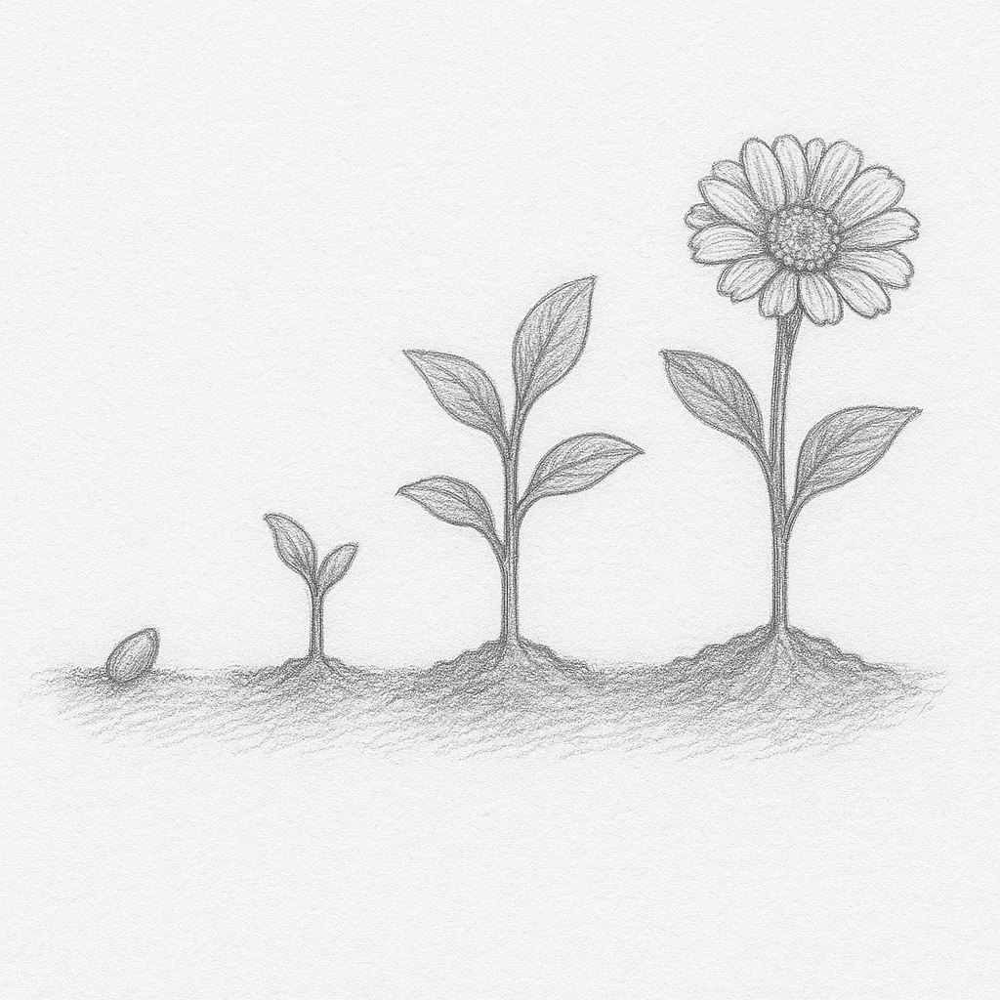

# **생명주기(Lifecycle)**




>“인생은 목적지가 아니라,
그 여정 자체가 의미 있는 것이다.” — 랄프 왈도 에머슨


"생명이 없는 존재에게 생명주기라니…" 이말은 어딘가 모순처럼 들릴 수 있다. 하지만 이 단어는 적어도 프로그래밍 세계에서 중요한 의미를 가지고 있다. 객체가 생성되고, 사용되고, 사라지기까지의 전 과정을 우리는 통칭하여 이것을 라이프사이클 (lifecycle) 이라고 부른다.

우리가 프로그램상에 만든 실체, 즉 객체는 물리적으로 만질수 있는 그런존재가 아니다. 실제로 눈에 보이지 않지만 메모리구조 어딘가에는 해당 객체를 위한 공간이 존재하고, 그 공간이 실제로 무언가의 역할을 수행하고 있다는 의미이다. 그리고 사용이 끝난 객체는 가비지 컬렉터(청소부라고 생각하면 편하다)에 의해 메모리에서 해제되고 ‘죽었다’고 표현되는 것이다.

객체의 일반적인 생명주기를 이해했다면, 이제는 Flutter 프레임워크 내에서의 생명주기에 집중할 차례이다. Flutter에서는 우리가 눈으로 보는 화면, 즉 UI의 모든 구성요소가 위젯으로 표현되며, 이 위젯들은 사용자의 행동이나 시스템의 변화에 따라 생성되고, 변화하고, 사라지는 과정을 거친다. 예를 들어 사용자가 다른 화면으로 이동하거나, 버튼을 눌러 상태가 변경되면 해당 위젯은 화면에서 사라지거나 다시 그려지는 등 일련의 상태 전환이 발생한다.

Flutter는 이런 변화에 따라 호출되는 특정한 함수들(callback)을 제공하며, 이를 통해 개발자는 각 단계마다 필요한 작업을 수행할 수 있다. 이러한 함수들을 우리는 위젯의 생명주기(Lifecycle)(콜백) 메서드라고 부른다. 이들은 단순한 기능이 아니라, 앱의 동작 흐름과 상태 관리를 가능하게 해주는 중요한 도구이다.

## **StatefulWidget의 생명주기**
StatelessWidget의 경우 생명주기라고 할것도 없이 단순한 구조이다. 따라서 StatefulWidget의 생명주기를 알아보기로 한다. StatefulWidget의 생명주기 메서드는 아래와 같은 흐름으로 호출된다. 주의 할것은 흐름에 따라서 한번만 호출되기도 하고, 반복적으로 호출되기도 한다는 점이다.

```dart
[1] StatefulWidget 생성자 호출
      ↓
[2] createState() State 객체 생성
      ↓
[3] initState() 최초 1회만 호출, 초기 상태값 설정
      ↓
[4] didChangeDependencies() 상위 InheritedWidget 등 종속 객체 감지 시 호출 (최초 1회 + 변화 시)
      ↓
[5] build() UI 최초 그리기 (이후 상태 변경될 때마다 반복 호출)

===== [상태 변화 발생 시] =====
      ↓
[6] setState() 상태 변경 요청
      ↓
[7] build() 변경된 상태를 반영하여 UI 다시 그리기

===== [상위 위젯에서 위젯 변경 시] =====
      ↓
[8] didUpdateWidget() 동일한 State를 유지한 채 새로운 StatefulWidget이 전달됨
      ↓
[9] build() 새로운 위젯 정보 반영하여 다시 렌더링

===== [위젯 제거 과정] =====
      ↓
[10] deactivate() 위젯 트리에서 제거 직전 호출
      ↓
[11] dispose() 완전 제거 직전 호출 (컨트롤러 해제, 리소스 정리 등 수행)
```

위 도표만으로는 정확히 이해하기 힘들다. 이제 직접 Flutter에서 StatefulWidget이 어떻게 생성되고, 어떤 생명주기를 따라가는지 살펴보자.

---

## 콜백 메서드
각각의 생명주기와 관련된 콜백 메서드가 어떤 역할을 하는지 살펴보겠습니다. 이 메서드들은 단순히 기술적인 호출이 아니라, 위젯의 탄생부터 소멸까지의 흐름 속에서 반드시 필요한 작업 포인트 입니다.

### **initState**

StatelessWidget에서는 build() 하나로 충분했지만, 잘 알고있듯이StatefulWidget은 조금더 복잡하다. 상태관리를 위한 State를 생성해야하고, 그에 따른 다양한 메서드들의 구현이 필요하다. 그 시작점이 바로 initState()이다. 

```dart
// State 를 상속합니다.
class _CounterPageState extends State<CounterPage> {
  int counter = 0;
  late final TextEditingController _controller;
  Timer? _timer;
  String _message = '';

  @override
  void initState() { //initState() 를 override 합니다.
    super.initState();
    print('initState 호출됨');
    
    // 텍스트 필드 컨트롤러 초기화
    _controller = TextEditingController();

    // 타이머 설정 (1초 후 메시지 변경)
    _timer = Timer(Duration(seconds: 1), () {
      setState(() {
        _message = '1초가 지났습니다!';
      });
    });

    // 비동기 데이터 로딩 (예: API 호출)
    fetchData();
  }
  //...
```

initState 메서드는 해당 위젯이 맨 처음 생성될 때 한 번만 호출된다. 화면이 아직 렌더링되기 전(화면에 표시되기)이므로, “비동기 호출 관련, 컨트롤러 초기화, 초기 상태 세팅” 등의 대부분은 여기서 각종 초기화 관련 처리를 작성하게된다. 

>**[팁&노트]**
“왜 build()가 아닌 initState()에서 초기화할까?” build()는 화면이 다시 그려질 때(갱신)마다 반복 호출되는 특징이 있다. 따라서 build에 초기화 관련 코드를 작성하는것은 적합하지 않다.(반복해서 초기화관련 코드가 실행된다.)

---

**didChangeDependencies**
initState()가 호출된 후, 곧이어 호출 되는 또 하나의 생명주기 메서드가 있다. 바로 didChangeDependencies()이다. 이 메서드는 직역해보면 그 의미 그대로, 우리 위젯이 의존하고 있는 상위에 데이터(Dependencies)에 변화가 생겼을 때 호출된다는 걸 알수 있다. 아래의 코드를 통해 _ThemedTextWidgetState 에 있는 didChangeDependencies가 언제 호출되는지 간단하게 확인해보자.

```dart
import 'package:flutter/material.dart';

/// 테마 색상을 표시하는 위젯
class ThemedTextWidget extends StatefulWidget {
  @override
  State<ThemedTextWidget> createState() => _ThemedTextWidgetState();
}

// 테마 색상을 표시하고, 감지하는 코드를 작성
class _ThemedTextWidgetState extends State<ThemedTextWidget> {
  Color? currentColor; // 현재 테마 색상

  @override
  void didChangeDependencies() { // didChangeDependencies() 를 override 하고, 언제 호출되는지 확인
    super.didChangeDependencies();
    //Theme 데이터의 변경을 감지하는 코드를 작성
    final theme = Theme.of(context); // 현재 테마를 가져옵니다.
    currentColor = theme.primaryColor; // 현재 테마의 primaryColor를 저장합니다.
    print('didChangeDependencies 호출됨 - primaryColor: $currentColor');
  }

  @override
  Widget build(BuildContext context) {
    // 현재 테마 색상(currentColor)을 표시하는 위젯을 반환합니다.
    return Text(
      '현재 테마 색상',
      style: TextStyle(color: currentColor, fontSize: 20),
    );
  }
}
```

<TODO 트리구조 그림 필요>

이번에는 트리구조상 좀 더 상위에 존재하는 위젯인 _MyAppState을 작성해보자. 버튼을 누르면 동적으로 Theme를 변경하는 구조이다.

```dart
import 'package:flutter/material.dart';

//시작은 main 입니다.
void main() {
  runApp(MyApp());
}

// MyApp 위젯은 StatefulWidget을 상속받아 상태를 관리합니다.
class MyApp extends StatefulWidget {
  @override
  State<MyApp> createState() => _MyAppState();
}

// State<MyApp>를 상속받아, 상태관리와 UI를 구현합니다.
class _MyAppState extends State<MyApp> {
  bool darkMode = false; // 상태값을 관리합니다. 초기값은 false로 설정되어 있습니다.

  @override
  Widget build(BuildContext context) {
    return MaterialApp(
      // theme 속성을 통해 현재 상태에 따라 테마를 설정합니다.
      theme: darkMode ? ThemeData.dark() : ThemeData.light(), // darkMode에 따라 테마를 변경합니다.
      home: Scaffold(
        appBar: AppBar(title: Text('테마 변경 테스트')),
        body: Center(child: ThemedTextWidget()), //ThemedTextWidget 먼저 작성한 하위 위젯
        floatingActionButton: FloatingActionButton(
          onPressed: () { //버튼을 누르면 테마 상태를 변경한다.
            setState(() { 
              darkMode = !darkMode; //테마를 변경/저장한다.
            });
          },
          child: Icon(Icons.brightness_6),
        ),
      ),
    );
  }
}
```

조금은 복잡한 예제이지만, 실행해보면 didChangeDependencies 가 잘 호출되고, 버튼을 눌렀을때, 변경된 테마의 컬러값을 가져오는것을 확인할수 있다.

**”단순히 상위 위젯에 있는 상태값이 변경되면, 하위 위젯에 있는 didChangeDependencies가 호출되는건가?”**

사실 didChangeDependencies는 단순히 상위 위젯의 화면 갱신 때문에 호출되는 그런 메서드가 아니다. 해당 메서드가 호출되기 위한 두가지 조건이 있다. 

1. State객체가 맨 처음 생성되고 나서 최초 한 번 호출됨.
2. InheritedWidget을 통해 의존성이 변경되었을 때 호출됨.

**"1번은 알겠는데, 아직 2번은 무슨 얘기인지 잘 모르겠다..."**

뒤에서 자세히 설명하겠지만, 이 경우는 InheritedWidget라는 특수한 위젯이 상위에 존재하고, 이를 하위위젯에서 사용한다고 가정했을때, 해당 상태가 변경되면 didChangeDependencies 의 호출이 발생하게 되는 것이다. 

그런데 위 예제에서 우리가 언제 InheritedWidget를 사용했단말인가? 비밀은 Theme에 있다. Theme.of(context)는 내부적으로 InheritedWidget을 상속한 _InheritedTheme 위젯을 통해 동작하는 구조이다. 이 덕분에 상위 테마 변경 시 하위 위젯의 didChangeDependencies()가 자동 호출되어, 테마 변경을 감지하고 대응할 수 있게 된다.

>**[팁&노트]**
'InheritedWidget' 은 부모 위젯이 자식에게 데이터를 효율적으로 전달하는 방식이다. 화면 UI나 직접 렌더링과는 무관하며, 순수하게 데이터 공유와 상태 관리를 위한 특수한 위젯이다. (예: Theme, MediaQuery, Provider등)[^1]

---


<TODO 도식화 구조 그림>


**build**
Flutter에서 가장 자주 보게 되는 함수 중 하나가 바로 build()이다. 이 함수는 쉽게말해 위젯이 화면에 어떻게 보여야 할지를 정의하며, UI 구성을 담당하는 핵심 함수이다. 도식화된 흐름을 보면 알수 있듯이 build()는 단 한 번만 실행되는 것이 아니라, 다음과 같은 경우에 반복적으로 호출될 수 있는 함수이다.

1. 위젯이 처음 생성되었을 때
2. setState()를 호출하여 상태가 변경되었을 때 (화면갱신요청)
3. 상위 위젯에 의해서 데이터가 갱신 되었을 때 (didUpdateWidget() 또는 didChangeDependencies() 이후 재호출)

initState에서 언급했듯이, build()함수 내부에는 초기화 코드나 네트워크 요청 같은 작업코드를 넣으면 안된다.(권장하지 않는다.) 이 함수는 이벤트에 의해 반복 호출되는 함수이기 때문이다.

첫번째, 맨 처음 StatefulWidget이 처음 생성될 때 생명주기의 흐름은 다음과 같다. initState → didChangeDependencies의 과정을 거쳐 build 함수가 호출되고 이를 통해 처음으로 UI가 화면에 표시(랜더링)된다.

```dart
[initState] → [didChangeDependencies] → [build]
```

두번째, 우리가 잘 알고있는 setState 함수를 통해 화면을 갱신 처리 할때이다. 여기서 내부적인 동작을 잠시 들여다 보자. 우리가 화면 갱신을 위해 setState()를 호출하면, Flutter 시스템은 해당 위젯의 내부상태를 “Dirty(더러움)” 로 변경한다. 이는 Flutter가 “이 위젯은 변경되었으니 다시 그려야 한다” 는 일종의 표식을 지정한 것이다. 이후에 Flutter 시스템은 “Dirty 상태” 를 감지하고, 결과적으로 해당 위젯의 build() 함수를 다시 호출해 UI를 새로 그리게 되는것이다.

세번째, didChangeDependencies나 didUpdateWidget 이후에 호출되는 경우이다. 앞서 살펴본 didChangeDependencies에 대해서는 알고 있으니, 이번에는 didUpdateWidget 가 호출되는 상황을 알아보자.(이번에는 InheritedWidget과 무관하다.)

어떤 경우에는 위젯이 자신의 setState()를 호출하지 않더라도, 화면을 다시 그려야 하는 경우가 발생하기도 한다. 예를 들어 상위 위젯을 통해 어떤 값을 전달 받고, 이 값을 사용하고 있다고 가정한다. 만약 이벤트에 따라서 상위 위젯의 데이터가 변경되었고, 그에 따른 새로운 값이 하위 위젯으로 전달되었다면 아래와 같은 일들이 벌어진다.

<TODO 그림필요>

1. 상위 위젯이 변경되어, build가 다시 호출되고 하위 위젯이 새로 생성됨.
2. 이때 State 객체는 그대로 유지됨.(Flutter 시스템은 하위 위젯이 가지고있는 State 객체를 재사용(유지)하기위해 노력한다.) 
3. 이 시점에 didUpdateWidget()가 호출됨.
4. didUpdateWidget 에서 상태값 업데이트에 따른 필요한 작업을 하고, 
5. 자신의 build()가 다시 호출됨.

```dart
[상위위젯] → [didUpdateWidget] → [build]
```


### AI와 함께 학습하세요
>Q. dart의 build 메서드에서 초기화 관련 작업을 진행해도 될까?


---

**didUpdateWidget**
하위 위젯이 상위 위젯에서 전달받은 상태정보에 의존하고 있다면, State 객체는 “자신을 생성해준 StatefulWidget 가 언제 새로 만들어지는지(상위 위젯의 변화로 인해)” 감지할 수 있어야 한다. 이 시점이 바로 UpdateWidget 가 호출되는 시점이다.

**“이 함수가 호출되었다는 뜻은 무엇일까?”** 

상위 위젯에서 어떤 이유로 상태 변화가 발생했고, 그 결과 하위 StatefulWidget이 새로 만들어졌다는 뜻이다. 주의할점은, 하위 위젯 스스로 setState()를 호출했다고 해서 didUpdateWidget이 호출되지는 않는다는 것이다. 이 함수는 오직 외부에서 발생한 변화에 반응한다.

```dart
void main() => runApp(MaterialApp(home: ParentWidget()));
```

여기 간단한 상위 위젯과 하위 위젯이 있다. 하위 위젯인 ChildWidget(text: message) 를 통해 message를 아래로 전달해주고 있다. 

```dart
import 'package:flutter/material.dart';

//상위 위젯
class ParentWidget extends StatefulWidget {
  @override
  State<ParentWidget> createState() => _ParentWidgetState();
}

//상위 위젯의 State 클래스
class _ParentWidgetState extends State<ParentWidget> {
  String message = 'Hello'; //상태정보

  @override
  Widget build(BuildContext context) {
    return Scaffold(
      appBar: AppBar(title: Text('didUpdateWidget 예제')),
      body: Column(
        mainAxisAlignment: MainAxisAlignment.center,
        children: [
          //하위 위젯으로 메시지를 전달한다.
          ChildWidget(text: message),
          SizedBox(height: 20),
          ElevatedButton(
            onPressed: () {
              setState(() { //버튼을 누르면 상태 정보를 변경한다.
                message = 'Hello Flutter!';
              });
            },
            child: Text('메시지 변경'),
          ),
        ],
      ),
    );
  }
}
```

여기서 코드를 자세히 보면 버튼을 눌렀을때 setState 함수를 호출 하고 있는걸 볼수있다. setState를 호출한다는것은 자신의 위젯이 갱신됨을 의미한다.

실행을 해보면, 버튼을 누르고 화면이 갱신되며, 우리가 모니터링하고 있는 didUpdateWidget 가 호출되는것을 확인할수 있다. (만약 이전에 생성된 widget의 정보가 필요하다면 매개변수로 내려온 oldWidget 를 활용하면 된다.)

하위 위젯도 마저 작성해보자.


```dart
// 하위 위젯
class ChildWidget extends StatefulWidget {
  final String text; //상태정보
  const ChildWidget({required this.text}); //상위에서 받아온 메시지를 상태에 저장한다.

  @override
  State<ChildWidget> createState() => _ChildWidgetState();
}

// 하위 위젯의 State 클래스
class _ChildWidgetState extends State<ChildWidget> {

  //언제 호출 되는지 자세히 확인해 보자.
  @override
  void didUpdateWidget(ChildWidget oldWidget) {
    super.didUpdateWidget(oldWidget);
    
    print('didUpdateWidget 호출됨');
    print('이전 메시지: ${oldWidget.text}'); 
    print('새 메시지: ${widget.text}');
  }

  @override
  Widget build(BuildContext context) {
    return Text(
      widget.text, //State는 widget 참조자를 암시적으로 가지고 있다.
      style: TextStyle(fontSize: 24),
    );
  }
}
```

## **심화학습**
didUpdateWidget 가 왜 이렇게 동작하는지 내부동작을 조금더 자세히 들여다 보자. Flutter는 위젯트리가 갱신될 때, 기존에 존재하던 State 객체를 유지하면서, 새로운 Widget 인스턴스와 연결하는 동작을 수행한다. 이 과정에서 Flutter는 update()라는 내부 메서드를 호출한다. 

```dart
@override
void update(StatefulWidget newWidget) {
  super.update(newWidget);
  final StatefulWidget oldWidget = _state.widget; // 기존 위젯 참조
  _state._widget = newWidget; // 새 위젯으로 교체
  _state.didUpdateWidget(oldWidget); // 교체되었으니 콜백 메서드 호출
}
```

이 코드를 보면 Flutter가 내부적으로 새로 전달된 Widget과 기존의 State를 연결하고, 변화가 생겼음을 어떻게 알려줄수 있는지 잘 드러난다. 이런 방식을 통해 잦은 업데이트에서도 성능은 유지하고, 새로운 데이터를 반영한 UI 갱신이 가능하게 되는것이다.


---

**dispose**
dispose()는 해당 객체가 더 이상 필요하지 않을 때, 메모리에서 정리되기 직전에 호출되는 함수이다. 마치 initState()가 위젯의 “탄생”을 알리는 순간이라면, dispose()는 “죽음”을 의미하는 시점이다. 이 함수가 호출된다는 것은 해당 State 객체가 이제 곧 Flutter 위젯 트리에서 완전히 제거된다는 뜻이다. 따라서 이 시점 이후에는 더 이상 해당 객체의 어떤 속성이나 메서드도 사용해서는 안 되며, 만약 사용하려 한다면 예외가 발생하거나 앱이 비정상적으로 동작할 수도 있다.

아래는 간단한 타이머 예제이다. 1초마다 count 값을 증가시키며, 한 번 시작되면 멈추지 않고 계속 실행된다. 가만히 두면 동작을 멈추지 않을것이다. 따라서 반복 호출되는 코드는 필연적으로 정리가 필요하다는걸 기억하자. dispose 메서드에서 타이머를 해제하는 코드를 작성한다. 

>반복되는 코드를 제대로 정리하지 않으면, 앱이 보이지 않는 곳에서도 계속해서 작업을 수행하게 되어 메모리 누수(memory leak)를 유발할 수 있다. (내가 어질러 놓은 방은 내가 치워야 하는것과 같다.)


```dart

class TimerWidget extends StatefulWidget {
  @override
  _TimerWidgetState createState() => _TimerWidgetState();
}

// 타이머를 관리하는 State 클래스
class _TimerWidgetState extends State<TimerWidget> {

  //타이머 객체
  late Timer _timer;
  //상태정보
  int _count = 0;

  @override
  void initState() { //초기화, 셋팅 관련 코드 작성
    super.initState();
    
    // 1초마다 _count를 증가시키는 타이머를 생성한다.
    _timer = Timer.periodic(Duration(seconds: 1), (timer) {
      setState(() { //타이머에 의해 1초 마다 화면이 갱신된다.
        _count++;
      });
    });
  }

  @override
  Widget build(BuildContext context) {
    return Center(
      child: Text('$_count', style: TextStyle(fontSize: 32)),
    );
  }

  @override
  void dispose() {
    // 타이머가 계속 돌아가는 걸 막기 위해 반드시 해제!
    _timer.cancel(); //cancel() 메서드를 호출하여 타이머를 정리한다.
    print('dispose 호출됨! 메모리 정리 완료.');
    super.dispose();
  }

}
```

만약 제대로 해제 하지 않고, 리소스를 방치하면 앱이 보이지 않는 곳에서도 계속해서 작업을 수행할수도 있게 된다. 예를 들어 타이머나 스트림, 애니메이션 컨트롤러, 포커스 노드, 텍스트 필드 컨트롤러 등은 명시적으로 해제하지 않으면 메모리 누수(memory leak)를 유발할 수 있다. 특히 이런 메모리 누수와 관련된 부분은 단기적으로 티가 나지 않기 때문에 더 주의해야한다. 이런 문제들이 쌓이고 쌓이면, 결과적으로 앱 성능에 큰 영향을 끼치게된다. (사용했으면, 반드시 정리하자!)


---


 [^1] InheritedWidget 클래스 : https://api.flutter.dev/flutter/widgets/InheritedWidget-class.html