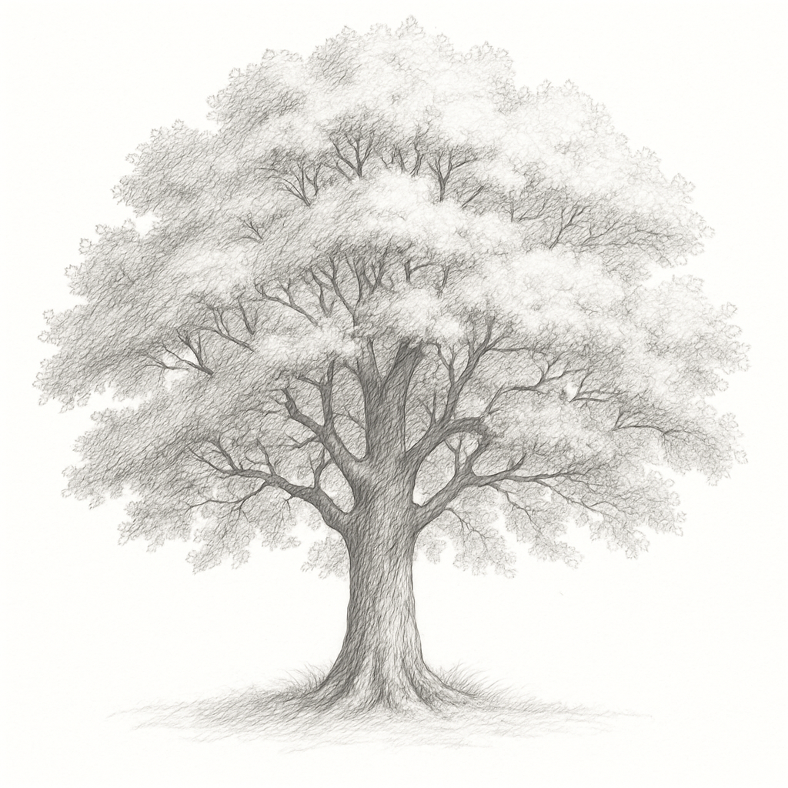

# 상태관리의 중요성





>“변화는 피할 수 없다. 그것에 어떻게 대응하느냐가 전부다.” — 존 맥스웰


플러터에서 '상태' 는 굉장히 중요한 요소이다. 따라서 "어디서 어떻게 상태를 관리 해야할지?" 이것이 우리의 메인 과제라고 할수 있다. 앞서 살펴봤듯이 ‘상태’ 는 현재 화면에 표시해야할 정보를 의미하며 이는 계속 해서 변화 한다. 또한 앱이 복잡해짐에 따라서 위젯의 계층구조(위젯트리)는, 마치 뿌리에서 시작된 나무처럼 차츰 거대해지고, 무럭무럭 자라나 그 가지가 셀수없이 뻗어나가게 된다. 계층구조가 깊어짐에 따라 표시해야할 정보의 양이 많아지고 그에 따른 상태 역시 많아진다. 당연히 상태가 많아지면 관리 하기가 어려워 지게 된다.

**“그렇다면 어떻게 상태관리를 해야할까?”**

예를 들어 10 계층 이상의 위젯트리구조안에서 각각의 하위위젯들이 각자 저마다의 상태를 가지고 있다면 그리고 만약 각 상태에 자유롭게 접근해야 한다면? 상상만으로도 머리가 지끈 아파 온다.

(* 이해를 돕기 위해 편의상 Level1,2,3 등으로 표현한다.)

<TODO 코드 검증 및 최적화 필요>

```dart
import 'package:flutter/material.dart';

//main 에서 시작하고, Level1 최상위 위젯을 최상위에 배치
void main() => runApp(Level1());

// 최상위 Level1 위젯
class Level1 extends StatefulWidget {
  @override
  _Level1State createState() => _Level1State();
}

class _Level1State extends State<Level1> {
  int _counter = 1; //최상위 위젯의 상태를 가지고 있다.

  @override
  Widget build(BuildContext context) {
    return MaterialApp(
      home: Scaffold(
        appBar: AppBar(title: Text('Level 1')),
        body: Column(
          children: [
            Text('Level 1 Counter: $_counter'),
            ElevatedButton(
              onPressed: () => setState(() => _counter++),
              child: Text('Increment Level 1'),
            ),
            Level2(), //하위 위젯으로 Level2를 배치
            
          ],
        ),
      ),
    );
  }
}

// 하위 위젯 Level2 위젯
class Level2 extends StatefulWidget {
  @override
  _Level2State createState() => _Level2State();
}

class _Level2State extends State<Level2> {
  int _counter = 2; //Level2역시 자신의 상태를 가지고 있다.

  @override
  Widget build(BuildContext context) {
    return Column(
      children: [
        Text('Level 2 Counter: $_counter'),
        ElevatedButton(
          onPressed: () => setState(() => _counter++),
          child: Text('Increment Level 2'),
        ),
        Level3(), //하위 위젯으로 Level3를 배치
      ],
    );
  }
}

// 위젯트리는 계속 뻗어 나간다.
// 하위 위젯 Level3 위젯
class Level3 extends StatefulWidget {
  @override
  _Level3State createState() => _Level3State();
}

class _Level3State extends State<Level3> {
  int _counter = 3;

  @override
  Widget build(BuildContext context) {
    return Column(
      children: [
        Text('Level 3 Counter: $_counter'),
        ElevatedButton(
          onPressed: () => setState(() => _counter++),
          child: Text('Increment Level 3'),
        ),
        Level4() // 하위 위젯으로 Level4를 배치
      ],
    );
  }
}

// 위젯트리에서 끝없이... 뻗어 나가는 가지
// 하위 위젯 Level4 위젯
class Level4 extends StatefulWidget {
  @override
  _Level4State createState() => _Level4State();
}

class _Level4State extends State<Level4> {
  int _counter = 4;

  @override
  Widget build(BuildContext context) {
    return Column(
      children: [
        Text('Level 4 Counter: $_counter'),
        ElevatedButton(
          onPressed: () => setState(() => _counter++),
          child: Text('Increment Level 4'),
        ),
       
      ],
    );
  }
}
```

위 코드에서 각각의 위젯들은 자신의 상태를 가지고 있으며, 자세히 살펴보면 저 마다의 방식으로 화면을 갱신하고 있다. 이런 방식은 언젠가 문제가 발생할 여지를 가지고 있다. 위젯 마다 자기만의 상태(_counter)를 가지고 있기 때문에, 위젯트리가 커짐에 따라 관리의 난이도 또한 올라가는 구조이다. 결국 이렇게 작성된 코드는 유지보수, 기능확장시 매우 비효율인 코드가 된다.

## **개선방법1 : 아래로 더 아래로...**

이번에는 조금 개선된 방법이다. 기본적인 아이디어는 각 기능별로, 업무별로, 관련그룹을 나누어 해당 그룹내의 상위 위젯을 설정하는 것이다. 그리고 그 상위 위젯에서만 상태를 관리 하도록 작성하는 방식이다. 또한 이 방식으로 값을 전달하려면, 상위 위젯에서 하위 위젯을 생성하는 시점에 생성자 파라미터로 상태값을 전달 해야한다.


<TODO 그림 필요>

예제를 통해 MyApp -> Level3Widget 까지 상태를 전달하는 방법을 살펴보자. 

```dart
//상위 위젯에서 관리
import 'package:flutter/material.dart';

//main 에서 시작하고, MyApp 최상위 위젯을 최상위에 배치
void main() => runApp(MyApp());

// 상위 상태를 가진 위젯
class MyApp extends StatelessWidget {
  // 공유할 상태를 정의
  final String sharedState = '공유할 상태정보';

  @override
  Widget build(BuildContext context) {
    return MaterialApp(
      home: Level1Widget(state: sharedState), // 생성자를 통해 상태 전달
    );
  }
}

// 1단계 위젯
class Level1Widget extends StatelessWidget {
  final String state; // MyApp 에서 전달된 상태

  Level1Widget({required this.state});

  @override
  Widget build(BuildContext context) {
    return Scaffold(
      appBar: AppBar(title: Text('Level 1')),
      body: Level2Widget(state: state), // 생성자를 통해 상태전달
    );
  }
}

// 2단계 위젯
class Level2Widget extends StatelessWidget {
  final String state; // MyApp -> Level1 에서 전달된 상태

  Level2Widget({required this.state});

  @override
  Widget build(BuildContext context) {
    return Column(
      children: [
        Text('Level 2 에서 받은 상태: $state'), 
        Level3Widget(state: state), // 생성자를 통해 상태전달
      ],
    );
  }
}

// 3단계 위젯
class Level3Widget extends StatelessWidget {
  final String state;// MyApp -> Level1 -> Level2 에서 전달된 상태

  Level3Widget({required this.state});

  @override
  Widget build(BuildContext context) {
    // 굉장히 멀리서 온... 상태를 받아서 잘 사용한다.
    return Text('Level 3 에서 받은 상태: $state'); 
  }
}
```

위에서 아래로 내려오는 상태 관리 아이디어는 얼핏 보면 굉장히 좋은 구조처럼 보일수도 있다. (실제로도 단순한 구조에서는 꽤 쓸모가 있다.) 하지만 문제는 실무에서 앱구조가 절대 단순하지 않다는데 있다. 해당 코드는 약간의 개선 버전이 분명하지만, 사실은 매우 비효율적인 방식이다. 위젯계층구조가 깊으면 깊어질수록 밑으로 끝없이 전달하는 구조이기 이다.

<TODO 그림필요>


## 개선방법2 : 아래에서 올려주기
이 아이디어는 하위 위젯의 어딘가에서 각자의 상태정보를 관리하다가 특정 이벤트시점에 의해 상태가 변경되면, 상위 위젯의 메서드에 접근(호출)하여 매개변수로 자신의(하위) 상태값을 전달하는 방법이다. 


<TODO 그림필요>


호출된 상위의 메서드는 계산로직을 수행하고, 계산된 상태결과를 아래로 내려주거나, 그 결과를 가지고 자신의 화면을 갱신할 수도 있다. 이런 방식은 꽤 괜찮은 아이디어 처럼 보인다. 

아래는 상위위젯에서 상태를 표시하고, 하위 위젯에서 버튼을 눌러 과일을 선택하는 예제이다.

```dart
import 'package:flutter/material.dart';

void main() {
  runApp(ParentApp());
}

// 상위 상태를 가진 위젯
class ParentApp extends StatefulWidget {
  @override
  _ParentAppState createState() => _ParentAppState();
}

class _ParentAppState extends State<ParentApp> {
  // 상위 위젯의 상태 변수
  String _selectedValue = '아직 선택되지 않음';

  // 하위 위젯에서 호출할 콜백 메서드
  // 선택한 '과일' 이름을 받아서 상태를 업데이트
  void _updateValue(String newValue) {
    setState(() {
      _selectedValue = newValue;
    });
  }

  @override
  Widget build(BuildContext context) {
    return MaterialApp(
      home: Scaffold(
        appBar: AppBar(title: Text('아래에서 위로 상태 올리기')),
        body: Center(
          child: Column(
          mainAxisAlignment: MainAxisAlignment.center,
          children: [
            Text('상태 정보 표시 : $_selectedValue',
                style: TextStyle(fontSize: 20)),
            SizedBox(height: 20),
            // 하위 위젯을 생성하고, 콜백 메서드 참조를 전달
            ChildWidget(onValueSelected: _updateValue),
          ],
        ),
       ),
      ),
    );
  }
}

// 하위 위젯
class ChildWidget extends StatelessWidget {
  // 상위에서 내려온 함수타입을 받기위해 작성
  final void Function(String) onValueSelected; 

  ChildWidget({required this.onValueSelected});

  @override
  Widget build(BuildContext context) {
    return Column(
      children: [
        ElevatedButton(
          onPressed: () { // 버튼을 누르면
            onValueSelected('사과'); //선택에 따라 함수를 호출하고 과일 이름을 전달한다.
          },
          child: Text('사과 선택'),
        ),
        ElevatedButton(
          onPressed: () {
            onValueSelected('바나나');
          },
          child: Text('바나나 선택'),
        ),
      ],
    );
  }
}

```

## 특수한 위젯을 사용하기
몇가지 아이디어를 구현해 봤지만 부족 하거나 아직 불편한 점이 많다. 이번에는 InheritedWidget 이라는 특수한 위젯을 사용하여 상태관리 하는 방법을 알아보자. 위에서 처럼 관련 그룹의 상위 위젯에서 상태를 관리하는 아이디어는 동일하다. InheritedWidget 위젯은 위젯이지만 위젯이 아니다. 이 위젯은 화면구성에 관여하지 않으며 오직 상태 관리에만 활용되도록 고안된 위젯이기 때문이다. (필수 구현 함수인 build 조차 없다.)

우선은 InheritedWidget를 상속하는것으로 시작한다.

```dart
// InheritedWidget 을 상속받은 위젯
class CounterInheritedWidget extends InheritedWidget {
  final int counter; // 상태값을 저장하는 변수
  final Function() increment;

  // 생성자에서 상태값과 함수를 받아 초기화
  const CounterInheritedWidget({
    required this.counter,
    required this.increment,
    required Widget child,
  }) : super(child: child);

  // 하위 위젯에서 접근할 수 있도록 of 메서드를 정의
  static CounterInheritedWidget? of(BuildContext context) {
    return context.dependOnInheritedWidgetOfExactType<CounterInheritedWidget>();
  }

  // 상태가 변경에 따라 하위 위젯을 갱신할지 여부를 결정하는 메서드
  @override
  bool updateShouldNotify(covariant CounterInheritedWidget oldWidget) {
    return oldWidget.counter != counter;
  }
}
```

위 코드가 기본적인 InheritedWidget의 구조이다. of 메서드, updateShouldNotify 메서드 등 아직은 이해가 가지 않지만, Widget임에도 build가 존재하지 않는다는 사실은 분명히 알수 있다. 그렇다면 이 위젯은 어떤 역할을 하는 것일까?

---

## **InheritedWidget**
Inherited Widget은 화면이 없는 혹은 화면과 관계 없는 특수한 위젯이다. 오로지 상태관리를 위해서만 존재하고, 트리 계층의 최상단에 위치하며, 관련된 그룹의 하위 위젯들이 이 상태를 공유할수 있도록 한다. (공유란 해당 상태 변수를 가져다 읽고, 쓸수 있는 상황을 의미한다.)

InheritedWidget 은 아래와 같이 작성한다. 우선 InheritedWidget를 상속하고 하고, 필수로 updateShouldNotify 를 재정의해주면 된다.

```dart
// InheritedWidget 을 상속받은 위젯
class CounterInheritedWidget extends InheritedWidget {
  final int counter; // 상태값을 저장하는 변수
  final Function() increment; // 상태를 갱신할 함수
  
  const CounterInheritedWidget({
    required Widget child,
    required this.counter,
    required this.increment,
  }) : super(child: child);

	// 하위 위젯에서 CounterInheritedWidget 을 참조하기 위한 함수
  // static 으로 작성하여 어디서든 쉽게 접근할 수 있도록 한다.
  static CounterInheritedWidget? of(BuildContext context) {
    return context.dependOnInheritedWidgetOfExactType<CounterInheritedWidget>();
  }

  // 하위 위젯의 재생성 여부를 결정하는 메서드
  // 상태가 변했는지 체크하고, true 를 리턴하면 하위 위젯들이 재생성된다.
  @override
  bool updateShouldNotify(covariant CounterInheritedWidget oldWidget) {
    return oldWidget.counter != counter;
  }
}
```

InheritedWidget 자체는 build가 없기 때문에 (보시다시피 화면과 관련된 정의가 없다.) StatelessWidget, StatefulWidget와 같은 위젯들과 복합적으로 구현하게 된다.

잠시 아래의 그림을 확인해보자. 최상위 위젯 MyApp 이 있고, 그 아래에 InheritedWidget이 자리잡고 있다. 그 아래에는 CounterDisplay와 CounterButton 같은 화면구성을 위한 위젯들을 배치한다.


이 그림을 토대로 구현한 예제를 살펴보고, InheritedWidget 이 어디에 속하는지, 상태 관리는 어떻게 하고 있는지를 유심히 살펴보자.

**전체 소스**

```dart
//Inherited Widget 예제
import 'package:flutter/material.dart';

void main() => runApp(MyApp());

// 상태 관리, 공유를 위한 InheritedWidget을 작성한다.
class CounterInheritedWidget extends InheritedWidget {
  final int counter; // 모든 위젯이 공유할 상태
  final Function() increment; // 필요한 경우 하위 위젯에서 호출할 함수

  // 생성자를 통해 상태와 함수를 전달받는다.
  const CounterInheritedWidget({
    required this.counter,
    required this.increment,
    required Widget child,
  }) : super(child: child);

  // 하위 위젯에서 InheritedWidget 데이터를 사용하기 위한 도우미 함수
  // static 키워드를 사용하여 어디서든 쉽게 접근할 수 있다.
  static CounterInheritedWidget? of(BuildContext context) {
    return context.dependOnInheritedWidgetOfExactType<CounterInheritedWidget>();
  }

  // 상태가 변경되었는지 확인하고, true를 리턴하면 하위 위젯들이 재생성된다.
  // 반대로 false 를 리턴하면 아무일도 일어나지 않는다.
  @override
  bool updateShouldNotify(covariant CounterInheritedWidget oldWidget) {
    return oldWidget.counter != counter;
  }
}

// 화면을 구성하는 최상위 위젯
class MyApp extends StatefulWidget {
  @override
  _MyAppState createState() => _MyAppState();
}

class _MyAppState extends State<MyApp> {
  int _counter = 0; // 상태 변수

  void _incrementCounter() { // counter 상태를 갱신하는 메서드
    setState(() {
      _counter++;
    });
  }

  @override
  Widget build(BuildContext context) { // 상태를 공유하는 InheritedWidget을 배치한다.
     
    // InheritedWidget을 사용하여 상태를 공유하기 위한 위젯
    // 최상위계층에 배치하여, 하위 위젯들이 이 상태를 공유할 수 있도록 한다.
    return CounterInheritedWidget(
      counter: _counter, //생성자를 통해 상태 전달
      increment: _incrementCounter, // 생성자를 통해 함수 전달
      child: MaterialApp( // 그 하위에 화면을 구성하는 실제 위젯들을 배치한다.
        home: Scaffold(
          appBar: AppBar(title: Text('InheritedWidget 예제')),
          body: Column(
            mainAxisAlignment: MainAxisAlignment.center,
            children: [
              CounterDisplay(), // 화면을 구성하는 하위 위젯1
              CounterButton(),  // 화면을 구성하는 하위 위젯2
            ],
          ),
        ),
      ),
    );
  }
}

// 하위 위젯에서 InheritedWidget 의 상태 정보를 사용
class CounterDisplay extends StatelessWidget {
  @override
  Widget build(BuildContext context) {
    // static 메서드를 통해 상위 InheritedWidget에 접근
    final shared = CounterInheritedWidget.of(context); 
    return Center(
      // shared를 통해 counter 상태값을 읽어와서 화면에 표시
      child: Text('현재 값: ${shared?.counter ?? 0}', style: TextStyle(fontSize: 24)),
    );
  }
}

// 버튼을 눌러 상위 상태 업데이트하는 하위 위젯
class CounterButton extends StatelessWidget {
  @override
  Widget build(BuildContext context) {
    // static 메서드를 통해 상위 InheritedWidget에 접근
    final shared = CounterInheritedWidget.of(context);
    return ElevatedButton(
      onPressed: shared?.increment, // 버튼을 눌렀을때 increment 메서드를 호출
      child: Text('counter 값 증가'),
    );
  }
}
```

전체 코드를 자세히 보면 상태 변수인 counter와 필요시 호출되는 increment 메서드가 CounterInheritedWidget의 생성자를 통해서 전달하도록 작성되어 있다.

```dart
// InheritedWidget 정의
class CounterInheritedWidget extends InheritedWidget {
  final int counter; // 생성자를 통해 상태값을 전달받는다.
  final Function() increment; // 생성자를 통해 메서드 참조를 전달받는다.

  const CounterInheritedWidget({
    required this.counter, 
    required this.increment, 
    required Widget child,
  }) : super(child: child);

  static CounterInheritedWidget? of(BuildContext context) {
    return context.dependOnInheritedWidgetOfExactType<CounterInheritedWidget>();
  }

  @override
  bool updateShouldNotify(covariant CounterInheritedWidget oldWidget) {
    return oldWidget.counter != counter;
  }
}
```

위 예제에서 InheritedWidget은 상태변수를 직접 생성하고, 관리하는 주체가 아니며, 상태관련 정보와 기능을 연결해주는 중간 역할을 하고 있는걸 알수있다. 실제로 작성된 상태정보와 메서드관련 코드는 _MyAppState 안에 있는 counter, _incrementCounter 이다.

```dart
class _MyAppState extends State<MyApp> {
  int _counter = 0; //실제 상태 정보

  void _incrementCounter() { //상태를 갱신하는 메서드
    setState(() {
      _counter++;
    });
  }
  //...
}
```

### of
"_MyAppState 에 작성된 상태정보에 접근하려면 어떻게 하면될까?" 기존에 배운 InheritedWidget 을 쓰지 않는 방식이라면, 생성자를 통해 내리거나, 내리거나, 또 내리거는 방식을 썻을것이다. InheritedWidget 의 구현 코드를 유심히 보면 of 라는 특이한 함수가 보인다.

```dart
 static CounterInheritedWidget? of(BuildContext context) {
    return context.dependOnInheritedWidgetOfExactType<CounterInheritedWidget>();
  }

```

사실 of 라는 함수는 필수구현 해야하는 함수는 아니다. 하위 위젯들이 자유롭게 상태에 접근할수 있도록 편의를 위해 작성된 함수 이다. 함수작성 바디를 보면 dependOnInheritedWidgetOfExactType 라는 함수를 호출하고, 이 함수는 매개변수로 전달받은 해당 context를 기준으로 가장 가까운(트리 계층 구조상) InheritedWidget을 찾아주는 함수 이다. (하위 위젯에서 트리를 타고 올라가며 InheritedWidget을 찾는 방식이다. 따라서 이 함수를 호출하면 현재 context를 기준으로 가장 가까운 InheritedWidget을 찾아서 return 해준다.)


이해를 돕기 위해 코드를 조금더 살펴보자.

```dart
// 하위 위젯에서 InheritedWidget 데이터 사용
class CounterDisplay extends StatelessWidget {
  @override
  Widget build(BuildContext context) {
    final inherited = CounterInheritedWidget.of(context); // 만들어둔 InheritedWidget의 of 메서드를 호출하여 상태 정보에 접근
    return Center(
      child: Text('현재 값: ${inherited?.counter ?? 0}', style: TextStyle(fontSize: 24)),
    );
  }
}
```

CounterDisplay 라는 하위 위젯에서 CounterInheritedWidget.of(context)를 호출하고 있다. 이때 내부적으로는 context를 기준으로 현재 호출한 위젯의 context를 기준으로 트리 계층을 타고 위로 올라가며 InheriteWidget을 발견하면 해당 위젯을 return 하는식으로 동작하는것이다. (이해가 조금 어려울수 있다. 이러한 동작은 내부적으로 일어나는 일이니, 우선은 of(context) 를 호출해서 우리가 작성한  InheritedWidget 참조를 가져올수 있다고 이해하면 된다.)

CounterInheritedWidget.of(context) 호출을 통해 InheriteWidget참조를 얻고, 상위위젯에 존재하는 상태값에 마음대로 접근할수 있게 된다.

```dart
// 하위 위젯에서 InheritedWidget 의 상태 정보를 사용
class CounterDisplay extends StatelessWidget {
  @override
  Widget build(BuildContext context) {
    // static 메서드를 통해 상위 InheritedWidget에 접근
    final shared = CounterInheritedWidget.of(context); 
    return Center(
      // shared를 통해 counter 상태값을 읽어와서 화면에 표시
      child: Text('현재 값: ${shared?.counter ?? 0}', style: TextStyle(fontSize: 24)),
    );
  }
}
```

또한 상태정보를 읽는것 뿐만 아니라 변경을 위한 메서드 호출도 자유롭게 가능하다.

```dart
// 버튼을 눌러 상위 상태 업데이트
class CounterButton extends StatelessWidget {
  @override
  Widget build(BuildContext context) {
    // static 메서드를 통해 상위 InheritedWidget에 접근
    final shared = CounterInheritedWidget.of(context);
    return ElevatedButton(
      onPressed: shared?.increment, // 버튼을 눌렀을때 increment 메서드를 호출
      child: Text('증가하기'),
    );
  }
}
```

다음은 InheritedWidget 안에 있던 updateShouldNotify 대해서도 알아볼 차례이다. 상위에 있는 _MyAppState 을 자세히 보면 상태를 갱신하는 setState 함수가 보인다. 따라서 상위 위젯은 동적으로 갱신될 여지가 있고, 그에 따라서 하위 위젯들이 재생성 될수 있다고 추측해볼수 있다.

```dart
void _incrementCounter() {
  setState(() {
    _counter++;
  });
}
```

**"하위 위젯들은 상위 위젯의 상태 변경에 따라서, 항상 재생성되야 하는 운명을 그냥 받아드려야 하는건가?"**

### updateShouldNotify
이 함수는 static 키워드를 통해 작성되어있고, 해당 return 값(true of false)에 따라서 하위 위젯들을 재생성 할지 말지를 결정할수 있는 특수한 함수인 것이다. 즉 InheritedWidget 위젯이 속한 _MyAppState 의 setState가 호출되면(변경사항이 발생하면) 자동으로 InheritedWidget 에 있는 updateShouldNotify 메서드가 호출되고, 조건에 따라서(우리가 작성) true 혹은 false 를 반환하면 하위 위젯의 재생성 여부를 결정 할수 있게 된다.

```dart
@override
  bool updateShouldNotify(covariant CounterInheritedWidget oldWidget) {
    return oldWidget.counter != counter; //상태변화를 체크한뒤 하위위젯 재생성 여부를 결정.
  }
```


### AI와 함께 학습하세요
>Q. dart에서 상태관리에 대해서 공부중인데, InheritedWidget에 대해서 설명해줘.


---

## 심화학습
**“그냥 다 재생성 하면 되지 않나요?”**

답은 "된다" 이다. 안될이유는 없다.(모든 위젯을 재생성하는 것도 가능하다. 그러나 성능 측면에서는 비효율적이다.) 하지만 예를 들어보자. 하나의 화면에 100개의 위젯이 계층 구조를 이루고 있다고 가정해본다. 만약 최상위 위젯에서 상태가 변경이 일어났고, setState()가 호출되었다. 만약 이때마다 하위의 모든 위젯들이 자동으로 재생성된다면, 실제로 변경이 필요한 위젯은 몇 개 안 되더라도 나머지 99개가 불필요하게 다시 그려지게 된다. (굉장한 리소스 낭비일 것이다.) 이처럼 불필요한 재생성은 앱의 성능 저하로 직결되기 때문에, 정말 필요한 경우에만 하위 위젯을 갱신하도록 제어하는 메커니즘이 반드시 필요하다. 따라서 updateShouldNotify는 이러한 목적을 위해 존재하는 중요한 함수이다.

---


## **Copilot을 통해 실습해보세요!**
`InheritedWidget`을 통해 class를 직접 작성해보고 상태를 공유하는 구조를 익혀봅시다.
Copilot의 제안을 따라 빈칸을 완성해보세요.


```dart
import 'package:flutter/material.dart';

void main() => runApp(MyApp());

// 공유할 상태를 담는 InheritedWidget 정의
class MyData extends InheritedWidget {
  final String name;

  const MyData({
    required this.name,
    required Widget child,
  }) : super(child: child);

  // 하위 위젯에서 접근할 수 있도록 도우미 함수 작성
  static MyData? of(BuildContext context) {
    // Copilot이 자동완성할 수 있도록 메서드 작성
    return //...
  }

  @override
  bool updateShouldNotify(MyData oldWidget) {
    //자유롭게 하위 위젯의 갱신조건을 작성해보고, 테스트 해본다.
    return //...
  }
}
```

```dart
// 최상위 위젯
class MyApp extends StatelessWidget {
  @override
  Widget build(BuildContext context) {
    return MyData( //InheritedWidget 을 꼭대기에 작성합니다.
      name: '홍길동', // 공유할 데이터를 InheritedWidget 생성시점에 전달
      child: MaterialApp(
        home: Scaffold(
          appBar: AppBar(title: Text('InheritedWidget 실습')),
          body: Center(
            child: UserProfile(), // 하위 위젯에서 데이터 읽기
          ),
        ),
      ),
    );
  }
}

// InheritedWidget에서 데이터 읽는 하위 위젯
class UserProfile extends StatelessWidget {
  @override
  Widget build(BuildContext context) {
    // myData를 통해 상위 InheritedWidget에 접근하는 코드를 작성해보세요.
    final myData = //...

    return Text(
      '사용자 이름: ${myData?.name ?? "없음"}',
      style: TextStyle(fontSize: 24),
    );
  }
}
```